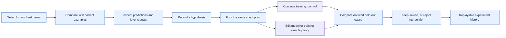

# Make one failure understandable — and test whether we can fix it

**WeightsLab · meeting brief · 25 September 2026**

**Status:** proposal and runnable scaffolding; real-data results are pending.

**Foundation:** [merged model-editing API, PR #287](https://github.com/GrayboxTech/weightslab/pull/287).

## The outcome we want

An engineer selects a meaningful failure, compares it with examples the model
gets right, inspects the relevant layers, and tries a controlled intervention.
The result shows what improved, what regressed, and exactly what changed.

Our first demonstration should answer: **Can an intervention improve one
coherent failure mode beyond simply training longer, while preserving ordinary
cases?** Improvement is a hypothesis to test, not an outcome we assume.

The transcript's rare-tiger example is the product story: explain a recurring
failure and test a remedy. An attribution heatmap alone cannot establish that
new neurons learned a particular concept or that insufficient capacity caused
the original failure.

## Decisions and todos for today's meeting

Suggested 25-minute agenda. Owners below are proposed, not assigned commitments.

| Time | Decision / todo | Proposed owner | Leave with |
|---|---|---|---|
| 0–5 min | Choose one dataset and failure group | Vi-Sri + ML reviewer | Waterbirds first; explicit group definition |
| 5–10 min | Agree the comparison and success criteria | Vi-Sri + ML reviewer | Equal training budget; ordinary-case regression bound |
| 10–15 min | Agree the first visual journey | Vi-Sri + Studio maintainer | Case selection → layer inspection → branch → comparison |
| 15–20 min | Review API and history ownership | Vi-Sri + backend maintainer | Layer identity, sampled signals, checkpoint/event contract |
| 20–25 min | Choose the next demo checkpoint | Team | GPU time, reviewer, next biweekly meeting and fallback day |

- [ ] Confirm Waterbirds as the first controlled experiment; Oxford Pets next.
- [ ] Pick the target group using training/validation evidence, then freeze the choice.
- [ ] Confirm frozen ViT-B/16 + editable MLP head as the first editing scope.
- [ ] Agree whether the proposed +5 percentage-point target and ≤1-point common-case
  regression budget are meaningful for this demo.
- [ ] Confirm where longer experiments belong and what small checks belong in CI.
- [ ] Request the existing Studio demo/reference so the prototype can follow its interaction style.
- [ ] Confirm the team member who will review model diagnostics and the Studio API contract.

## Three experiments, in order

| Experiment | Concrete question | Setup and intervention | Evidence / stop condition |
|---|---|---|---|
| **E1 · Waterbirds: unusual backgrounds** | Does head capacity or sample exposure explain failure on an atypical group? | Pretrained frozen ViT-B/16; fork one trained head checkpoint into continued training, wider head, group-balanced sampling, and wider head + balanced sampling. | Accuracy for every class/background group, margin, loss, corrected and newly broken examples. If the baseline has no recurring group failure, stop and report that before changing the protocol. |
| **E2 · Representation bottleneck** | Is the frozen representation limiting adaptation? | On the same selected cases, compare continued training with an unchanged head versus unfreezing the last ViT block. Keep architecture fixed and use a conventional PyTorch fine-tuning path until full-model editing is capability-tested. | Per-layer update/gradient traces and class-conditioned input attribution. Treat this as a separate representation experiment; it does not validate structural transformer edits. |
| **E3 · Oxford Pets: natural appearance variation** | Does the workflow transfer to a visually recognizable, naturally occurring subgroup? | Breed classification; manually review a coherent pose/occlusion subgroup and its confusable breed, then repeat the selected controlled comparison. | Fixed, labelled subgroup across train/validation/test. If subgroup support is too small, report an exploratory case study rather than a population-level result. |

Waterbirds provides bird-class/background groups and a reproducible setting for
atypical-context failures. It uses **composited images**, so it is a controlled
first experiment, not evidence about natural wildlife rarity. Preserve the
published splits and account for the known label notes in the authors' repository.
Source: [Waterbirds authors' dataset and protocol](https://github.com/kohpangwei/group_DRO#waterbirds).

Oxford-IIIT Pets provides 37 breeds, head boxes, and foreground trimaps. Pose or
occlusion subgroup labels would be our annotations, not supplied dataset labels.
Source: [Oxford-IIIT Pet dataset](https://www.robots.ox.ac.uk/~vgg/data/pets/).

Pin `ViT_B_16_Weights.IMAGENET1K_V1` and its preprocessing rather than a moving
default. Model reference: [Torchvision ViT-B/16](https://docs.pytorch.org/vision/stable/models/generated/torchvision.models.vit_b_16.html).

## What the engineer sees

Blue nodes describe the new diagnostics and comparison workflow. Model edits,
the ledger, and step-level model signals already have backend foundations.

The first screen should have four linked areas:

1. **Cases:** original image, label, prediction, confidence, margin, group,
   and human notes. A hard positive is a same-class example distant from an
   anchor; a hard negative is a different-class example close to it under a
   stated representation. Store the anchor and distance definition.
2. **Model inspector:** graph with selected layer, dimensions, frozen state,
   activation summaries, gradient norms, and weight-change history. Curves
   suggest hypotheses; they do not automatically diagnose capacity or label errors.
3. **Intervention:** checkpoint, target layer, edit preview, sample policy,
   and engineer's reason. The engineer chooses whether a valid difficult
   sample stays, is emphasized, or is excluded from a training branch.
4. **Comparison and history:** baseline/control/intervention side by side;
   subgroup results, ordinary-case regressions, selected images and attributions,
   plus a timeline of the checkpoint and every edit.

Start from a small known case set. Automated embedding-based discovery follows
after we establish which comparisons actually help engineers make decisions.

## Make the result defensible

- Select the failure mode on train/validation; lock the test manifest before
  intervention selection. Do not remove evaluation cases because they are hard.
- Fork identical model weights. Match seeds, update counts, batch schedule,
  preprocessing, and optimizer policy between paired arms. Log changed sampling
  separately from changed capacity. Reinitialize optimizers equally when a
  shape-changing edit cannot preserve optimizer state.
- Compare **post-training edit versus post-training control**, not only edited
  versus pre-training checkpoint. Also evaluate immediately after editing to
  separate the edit's instantaneous effect from subsequent learning.
- Run three paired seeds initially. Show group counts, per-seed results, and
  uncertainty. Three seeds and a small subgroup are preliminary evidence.
- Proposed pilot target: ≥5 percentage points on the selected subgroup versus
  continued training, ≤1 point common-case regression, and consistent direction
  across seeds. Agree these thresholds before looking at final test results;
  meeting them alone does not establish statistical significance.
- Show both corrections and regressions. A null result is useful: record whether
  more ordinary training, balanced exposure, or changing representation helped.

**Attribution boundary:** a frozen, deterministic backbone produces the same
attention for the same input after a head-only edit. Class-conditioned input
gradients may change because the head changed. Compute attribution through the
full image→backbone→head graph, with input gradients enabled; cached embeddings
alone cannot yield pixel attribution. Attention is a view of token interactions,
not a literal picture of everything the model "sees". Pin target class, baseline,
preprocessing and color scale across comparisons; record approximation error
for [Integrated Gradients](https://captum.ai/docs/extension/integrated_gradients).

If widening helps, a later ablation can disable only the newly added units to
test their contribution. Even that supports a contribution claim, not a claim
that an individual neuron represents "stripes".

## Delivery plan

These are work packages, not promised calendar dates. Start the first GPU pilot
after today's dataset and scope decisions.

| Package | Deliverable | Acceptance / handoff |
|---|---|---|
| **Now · planning draft** | This brief, experiment matrix generator, local synthetic smoke runner, proposed data contracts | Runnable scaffolding; synthetic results clearly labelled |
| **1 · baseline and cases** | Pretrained ViT checkpoint, dataset/split hashes, selected validation cases, locked test set | Repeatable subgroup failure; enough examples to evaluate it |
| **2 · controlled interventions** | Four E1 arms × three seeds, immediate-edit and post-training results | Checkpoint parity, optimizer rebinding, every-group metrics and regressions |
| **3 · diagnostic prototype** | Image comparison, layer histories, attribution, edit/history timeline | Same case and layer refer to the same snapshot across views |
| **4 · Studio integration** | Versioned requests, bounded signal fetches, edit acknowledgements and refreshed graph | Browser/server training pause, edit, resume and synchronization verified end to end |
| **Later · discovery** | Candidate hard-pair mining using the task model; optional external embeddings | Discovery quality evaluated separately; human review remains available |

Vi-Sri's proposed scope is the experiment, model representation, API/data
contracts and diagnostic prototype. Backend and Studio maintainers review how
those contracts join their existing systems. Keep each package reviewable in
its own PR; agree test placement with maintainers before adding long GPU jobs.

## Five-minute demonstration script

1. Show several examples of the same validation failure mode and a correct reference.
2. Point to the prediction margin and one informative layer comparison.
3. State the hypothesis, show the common checkpoint, and preview the intervention.
4. Replay recorded control/intervention runs; live training is optional.
5. Show held-out improvements **and** regressions, then the history needed to reproduce them.

Opening line for today's meeting:

> The editing API is merged. Next I want to make one recurring failure
> inspectable and test whether editing actually helps beyond training longer.
> We can start with known hard examples, keep the engineer in control, and build
> the API and visual comparison needed to bring that workflow into Studio.

Implementation entry point: [diagnostics scaffold](../../weightslab/examples/PyTorch/wl-model-editing/hard-example-diagnostics/README.md).
