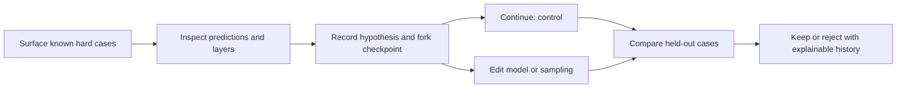

# From model editing to explainable experiments

WeightsLab · 8 October 2026 · meeting handout

**Decision requested:** agree one controlled failure-mode experiment and the
smallest useful inspection/comparison workflow. This is a proposal, not a
report of measured improvement.

> The editing API is merged. Next we want to show a real failure, explain what
> we suspect, try a model or data change, and see whether it helped more than
> simply training longer. The engineer should be able to inspect both the
> improvements and the damage, and replay exactly what changed.

## Today's five decisions

- [ ] **First dataset:** approve Waterbirds as a controlled starting point.
  Keep the published splits; identify the failure group on validation, not test.
- [ ] **Editing scope:** frozen pretrained ViT-B/16 plus an editable MLP head.
  Structural changes inside attention blocks are a separate capability gate.
- [ ] **Fair comparison:** one baseline checkpoint per seed, four arms, equal
  continuation budgets, and an identical optimizer-reset policy in every arm.
- [ ] **Demo contract:** show cases, layer evidence, the proposed intervention,
  and before/control/after comparison with history. Review the data contract
  before extending the shared proto.
- [ ] **Ownership and next checkpoint:** confirm an ML reviewer and a
  backend/Studio reviewer, GPU availability, and the next demo date. Suggested
  owner of the experiment, representation and prototype: Vi-Sri.

## First experiment: capacity or sample exposure?

Hypothesis: a recurring atypical-background failure may respond to more head
capacity, more exposure to underrepresented groups, both, or neither. Do not
assume a failure proves a capacity bottleneck.

| Arm | Hidden head width | Training sampling | What it isolates |
|---|---|---|---|
| A · Continue | 64 | Original | Additional training alone |
| B · Widen | 80 (+16) | Original | Added capacity versus A |
| C · Resample | 64 | Group-balanced | Changed sample exposure versus A |
| D · Both | 80 (+16) | Group-balanced | Capacity versus C; sampling versus B |

Proposed recipe: `ViT_B_16_Weights.IMAGENET1K_V1`, seeds **17, 29, 43**,
**500 baseline steps**, then **250 steps per arm**. Cache frozen features for
fast head experiments. These budgets are pilot settings, not a claim that the
baseline has converged. Check validation learning curves before locking the
protocol; record any revision before final test evaluation.

**Evidence required:** identical starting predictions; immediate-edit versus
post-training effect; every group's accuracy and count; worst-group accuracy;
corrected and newly broken examples; per-seed paired differences; checkpoint,
split and configuration hashes. Report empirical test accuracy separately from
the training-frequency-weighted benchmark average.

**Proposed demo target, to agree today:** at least +5 percentage points on the
selected group versus A, no more than 1 point common-case regression, and a
consistent direction across the three seeds. Define the common groups before
evaluation. These are practical pilot criteria, not statistical significance.
A null result is a valid outcome; do not keep changing the protocol until an
edit wins.

Waterbirds deliberately combines bird foregrounds with backgrounds. That makes
the groups reproducible, but it is not a natural rare-animal benchmark.
[Dataset and evaluation protocol](https://github.com/kohpangwei/group_DRO#waterbirds).

## What the demo should show

One selected image stays selected across four panels:

1. **Cases:** image, label, prediction, margin, group and human notes; also a
   correct reference case. Begin with known cases, not automated mining.
2. **Model:** layer path/identity, shape, activation summary, gradient norm and
   weight updates. Treat these as evidence for a hypothesis, not its proof.
3. **Decision:** show affected layers, sampling choice, parent checkpoint,
   optimizer policy and the engineer's reason before applying the edit.
4. **Comparison:** control and intervention results, corrections, regressions,
   and a replayable event timeline. Use a read-only recorded-run prototype first.

**Important visual boundary:** head-only edits cannot change attention in a
frozen deterministic backbone. Class-conditioned input attribution can change;
compute it through image → backbone → head with a fixed target class and
display scale. Do not draw a spatial heatmap from a cached CLS vector or call
attention a complete explanation of what the model sees.

## Work after the meeting, in order

| Gate | Concrete deliverable | Done when |
|---|---|---|
| 1 · Establish failure | Dataset adapter, pinned feature cache, baseline and validation case manifest | Failure is coherent and reproducible; test selection is locked |
| 2 · Test intervention | Four arms × three seeds with immediate and final snapshots | Same-parent checks, shape propagation, optimizer references and matched budgets pass |
| 3 · Make it inspectable | Case comparison, bounded layer diagnostics, attribution and history | Every view identifies the same case and model snapshot; missing data is explicit |
| 4 · Integrate Studio | Versioned requests and edit acknowledgement with architecture revision | Pause/edit/resume works; stale responses are rejected and the graph refreshes |

The architectural contribution is the **model representation and diagnostic
API/data contract**: stable case/snapshot/layer references, bounded measurement
requests, and explainable intervention history. The prototype UI tests whether
that information helps an engineer; it can later be ported into Studio.

Follow-ups: **E2**, keep the architecture fixed and unfreeze the last ViT block
to test a representation bottleneck; **E3**, repeat the workflow on a reviewed
natural-variation subgroup in Oxford Pets. Neither belongs in the first demo's
completion claim. [Full proposal](hard-example-diagnostics.md).

## What is available versus planned

- **Available:** a 12-job plan generator, proposed contracts, and a CPU
  synthetic smoke runner exercising public neuron addition, dependency
  propagation, optimizer binding and same-checkpoint comparisons.
- **Planned:** Waterbirds execution, pretrained feature extraction, image
  attribution, persistent replay, new RPCs and the Studio comparison screen.
- **Review boundary:** draft PR [#307](https://github.com/GrayboxTech/weightslab/pull/307)
  remains a planning/scaffolding PR. It does not claim to close issue #267.

Start with the [runnable scaffold](../../weightslab/examples/PyTorch/wl-model-editing/hard-example-diagnostics/README.md)
and its [proposed contracts](../../weightslab/examples/PyTorch/wl-model-editing/hard-example-diagnostics/CONTRACTS.md).
