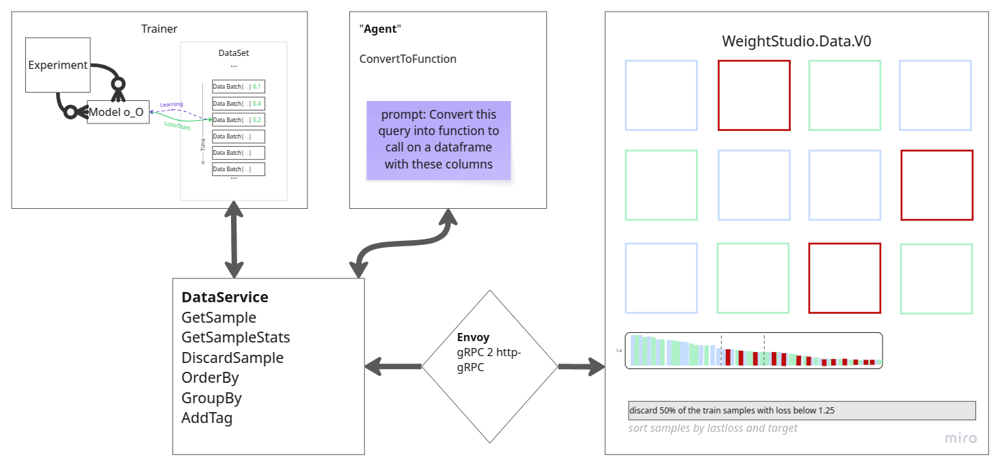

Weights Studio Guide
====================

Weights Studio is the visual frontend for WeightsLab experiments.
It connects to your running WeightsLab backend over gRPC-Web via Envoy,
and gives you interactive control over samples, tags, discard/restore actions,
training/audit mode, and training signal plots.

Architecture
------------

Runtime path:

1. Browser UI (Vite app)
2. Envoy proxy (gRPC-Web bridge)
3. WeightsLab Python gRPC service

Project location
----------------

Weights Studio source lives in:

- ``../weights_studio``

Key files:

- Docker compose: ``../weights_studio/docker/docker-compose.yml``
- Envoy config: ``../weights_studio/envoy/envoy.yaml``
- Frontend entrypoint: ``../weights_studio/src/main.ts``
- UI layout: ``../weights_studio/index.html``

Quick start (Docker)
--------------------

1. Start your WeightsLab backend (gRPC on host, default port ``50051``).
2. Load environment variables from ``../weights_studio/docker/.env``.
3. Start studio stack from ``../weights_studio/docker``:

   - Envoy
   - Frontend (Vite)

4. Open Weights Studio in your browser.

Docker services and ports
-------------------------

From ``../weights_studio/docker/docker-compose.yml`` and ``../weights_studio/envoy/envoy.yaml``:

- Frontend: ``VITE_PORT`` (default ``5173``)
- Envoy gRPC-Web endpoint: ``ENVOY_PORT`` (default ``8080``)
- Envoy admin: ``ENVOY_ADMIN_PORT`` (default ``9901``)
- Backend target from Envoy: ``host.docker.internal:50051``

Default values in ``../weights_studio/docker/.env``:

- ``VITE_PORT=5173``
- ``WS_SERVER_HOST=localhost``
- ``WS_SERVER_PORT=8080``
- ``WS_SERVER_PROTOCOL=http``
- ``ENVOY_PORT=8080``
- ``ENVOY_ADMIN_PORT=9901``
- ``GRPC_BACKEND_PORT=50051``

How the frontend endpoint is built
----------------------------------

In ``src/main.ts``, the UI builds the server URL from:

- ``WS_SERVER_PROTOCOL``
- ``WS_SERVER_HOST``
- ``WS_SERVER_PORT``

This URL is used as gRPC-Web base URL for ``ExperimentServiceClient``.

Environment/configuration checklist
-----------------------------------

Backend:

- Ensure WeightsLab serves gRPC and listens on host ``0.0.0.0:50051``.

Envoy:

- Ensure ``envoy.yaml`` cluster points to host backend:
  ``host.docker.internal:50051``.

Frontend:

- Ensure frontend points to Envoy (default ``http://localhost:8080``).

Sanity checks:

- Studio reachable at ``http://localhost:5173``.
- Envoy admin reachable at ``http://localhost:9901``.

Server integration (AWS example)
--------------------------------

This section describes a practical cloud deployment path for WeightsLab +
Weights Studio on AWS.

Recommended production architecture
~~~~~~~~~~~~~~~~~~~~~~~~~~~~~~~~~~~

- **UI**: Weights Studio frontend behind HTTPS (ALB).
- **gRPC-Web bridge**: Envoy service reachable by frontend.
- **Backend**: WeightsLab training service (Python gRPC).
- **Storage**: EBS/EFS/S3 for logs/checkpoints depending on your workflow.

Two common deployment options
~~~~~~~~~~~~~~~~~~~~~~~~~~~~~

1. **EC2 (fastest to start)**

   - Run WeightsLab backend process on the VM (port ``50051``).
   - Run Envoy + frontend via Docker Compose.
   - Use one security group to expose only HTTPS (and optionally admin ports
     privately).

2. **ECS/Fargate (container-native)**

   - Service A: frontend container.
   - Service B: Envoy container.
   - Service C: WeightsLab backend container (or external training worker).
   - Route through ALB + target groups.

Minimum port plan (AWS)
~~~~~~~~~~~~~~~~~~~~~~~

- Public ingress:
  - ``443`` (HTTPS to frontend/ALB)
- Internal service ports:
  - ``8080`` (Envoy gRPC-Web listener)
  - ``50051`` (WeightsLab backend gRPC)
  - ``9901`` (Envoy admin, keep private)
  - ``5173`` (frontend dev port; avoid exposing directly in production)

Security group guidance
~~~~~~~~~~~~~~~~~~~~~~~

- Allow ``443`` from trusted client CIDRs (or internet if required).
- Restrict ``50051`` and ``8080`` to VPC/internal security groups.
- Restrict ``9901`` to private admin subnet/bastion only.
- Do not expose backend gRPC directly to the public internet.

TLS and domains
~~~~~~~~~~~~~~~

- Terminate TLS at ALB using ACM certificates.
- Use a DNS record (Route 53) for the studio hostname.
- Forward ALB target traffic to frontend service.
- Keep Envoy/backend internal where possible.

Environment mapping (cloud)
~~~~~~~~~~~~~~~~~~~~~~~~~~~

For Weights Studio frontend + Envoy alignment, set environment variables
consistently with your deployed endpoints:

.. code-block:: ini

   # frontend resolves gRPC-web through Envoy
   WS_SERVER_PROTOCOL=https
   WS_SERVER_HOST=studio.your-domain.com
   WS_SERVER_PORT=443

   # envoy / backend internal wiring
   ENVOY_PORT=8080
   ENVOY_ADMIN_PORT=9901
   GRPC_BACKEND_PORT=50051

If Envoy is internal-only and frontend is public, ensure frontend requests are
routed to the Envoy endpoint through your internal load-balancing design.

AWS deployment checklist
~~~~~~~~~~~~~~~~~~~~~~~~

1. Provision VPC/subnets and security groups.
2. Deploy backend gRPC service and verify ``:50051`` internally.
3. Deploy Envoy and verify routing to backend.
4. Deploy frontend with correct ``WS_SERVER_*`` values.
5. Attach ALB + ACM certificate and configure HTTPS listener.
6. Validate UI actions (query, tagging, discard/restore, plots).
7. Add monitoring/logging (CloudWatch metrics/logs).

Operational notes
~~~~~~~~~~~~~~~~~

- Prefer long-running backend workers for stable interactive sessions.
- Keep checkpoint/log storage durable (EBS/EFS/S3 strategy).
- If using autoscaling, ensure session and backend availability are handled
  explicitly for active users.
- For multi-environment setups, keep per-environment ``.env`` templates
  versioned and reviewed.

Concrete EC2 + Docker Compose + systemd recipe
~~~~~~~~~~~~~~~~~~~~~~~~~~~~~~~~~~~~~~~~~~~~~~

Use this pattern for a simple single-VM production-like deployment.

1. Provision EC2

  - Ubuntu 22.04 (or similar), attached security group.
  - Open only ``443`` publicly.
  - Keep ``50051``, ``8080``, ``9901`` private (VPC/admin only).

2. Install runtime dependencies

  - Docker Engine + Docker Compose plugin
  - Python environment for your WeightsLab backend process

3. Configure environment

  In ``weights_studio/docker/.env`` (or environment management equivalent):

  .. code-block:: ini

    VITE_PORT=5173
    WS_SERVER_PROTOCOL=https
    WS_SERVER_HOST=studio.your-domain.com
    WS_SERVER_PORT=443

    ENVOY_PORT=8080
    ENVOY_ADMIN_PORT=9901
    GRPC_BACKEND_PORT=50051

4. Start backend service

  Start WeightsLab gRPC in your training/runtime process and ensure it binds
  to a reachable interface (for example ``0.0.0.0:50051``).

5. Start studio containers

  From ``weights_studio/docker``:

  .. code-block:: bash

    docker compose up -d

6. Add process supervision (systemd)

  Use systemd to ensure services restart on reboot/failure.

  Example unit for studio compose stack:

  .. code-block:: ini

    [Unit]
    Description=Weights Studio (Docker Compose)
    Requires=docker.service
    After=docker.service

    [Service]
    Type=oneshot
    WorkingDirectory=/opt/weights_studio/docker
    ExecStart=/usr/bin/docker compose up -d
    ExecStop=/usr/bin/docker compose down
    RemainAfterExit=yes
    TimeoutStartSec=0

    [Install]
    WantedBy=multi-user.target

  Enable and start:

  .. code-block:: bash

    sudo systemctl daemon-reload
    sudo systemctl enable weights-studio
    sudo systemctl start weights-studio

7. Put HTTPS in front (ALB + ACM)

  - Attach ACM certificate to ALB listener on ``443``.
  - Route DNS (Route 53) to ALB.
  - Forward traffic to frontend target.

8. Validate end-to-end

  - Open studio URL.
  - Verify sample query, tag/discard actions, and plot refresh.
  - Verify backend logs and Envoy admin stats.

UI controls and actions
-----------------------

Top header controls
~~~~~~~~~~~~~~~~~~~

- **Dark mode toggle**: switch light/dark theme.
- **Refresh button**: manually refresh dynamic stats in visible grid.
- **Refresh config popover**:
  - Data auto-refresh enable/disable + interval
  - Plot auto-refresh enable/disable + interval
  - Clear cache and reload page
- **Training button** (Resume/Pause): toggles ``is_training`` via backend command.
- **Mode selector** (dropdown next to training button):
  - ``train`` mode
  - ``audit`` mode (sets ``auditorMode``)

Left panel
~~~~~~~~~~

- **Training card**:
  - Training state pill (running/paused/pending)
  - Connection status text
  - Live metrics and progress
- **Tags card**:
  - Tag chips
  - New tag input
  - Painter toggle
  - Add/remove painter mode switch
- **Details card**:
  - Grid settings (cell size + resolution + apply)
  - Segmentation overlays (Raw, GT, Pred, Diff, Split view)
  - Split colors
  - Metadata field toggles

Grid interactions
~~~~~~~~~~~~~~~~~

- Drag selection rectangle (multi-select).
- ``Ctrl`` multi-select support.
- Right-click context menu actions:
  - Manage tags
  - Remove all tags
  - Discard selected samples
  - Restore selected samples

The UI pauses training before data-modifying actions to keep edits safe.

Bottom bar
~~~~~~~~~~

- Batch slider for navigation over samples.
- Start/end batch index labels.
- Total and active sample counters.

Image detail modal
~~~~~~~~~~~~~~~~~~

- Large image preview with previous/next navigation.
- Zoom in/out/reset controls.
- Metadata detail panel.
- Volumetric support with Z-slice slider when applicable.

Signal plots
~~~~~~~~~~~~

Per-signal cards include:

- Reset zoom
- CSV export
- JSON export
- Settings (curve color, smoothing, std band, markers)

Right-click menu on plots includes:

- Reset X/Y/all zoom
- Change curve color
- Load weights at clicked step
- Hide/unhide curve
- Break by slices
- Copy chart image
- Save chart image

WeightsLab CLI console (dev)
----------------------------

The WeightsLab CLI console is a local developer REPL for inspecting and
controlling a running experiment through the global ledger.

- Transport: local TCP text commands with JSON responses.
- Intended scope: development/debug only.
- Security model: localhost binding by default, plain-text protocol.

How to start it
~~~~~~~~~~~~~~~

From your training script (recommended):

.. code-block:: python

  import weightslab as wl

  wl.serve(serving_grpc=True, serving_cli=True)
  wl.keep_serving()

Standalone server:

.. code-block:: bash

  python -m weightslab.backend.cli serve --host localhost --port 60000

Connect a client manually:

.. code-block:: bash

  python -m weightslab.backend.cli client --host localhost --port 60000

If no port is provided (or port is ``0``), the server picks a free port.

Console actions and commands
~~~~~~~~~~~~~~~~~~~~~~~~~~~~

Discovery and help:

- ``help`` / ``h`` / ``?``: show all command syntaxes and examples.
- ``status``: compact snapshot of models, loaders, optimizers, hyperparams.
- ``dump``: sanitized ledger dump (dataloaders, optimizers, hyperparams).

Training control:

- ``pause`` (or ``p``): pause training and set ``is_training=False``.
- ``resume`` (or ``r``): resume training and set ``is_training=True``.

Registry inspection:

- ``list_models``
- ``list_optimizers``
- ``list_loaders``
- ``plot_model [model_name]``: prints model architecture text tree.

Sample-level dataset operations:

- ``list_uids [loader_name] [--discarded] [--limit N]``
- ``discard <uid> [uid2 ...] [--loader loader_name]``
- ``undiscard <uid> [uid2 ...] [--loader loader_name]``
- ``add_tag <uid> <tag> [--loader loader_name]``

Hyperparameter operations:

- ``hp``: list hyperparameter sets.
- ``hp <name>``: show one set.
- ``set_hp [hp_name] <key.path> <value>``: update one key path.

Model architecture operation:

- ``operate [model_name] <op_type:int> <layer_id:int> <nb|[list]>``

Session control:

- ``exit`` / ``quit``: close client session.
- ``clear`` / ``cls``: client-side terminal clear (not sent to server).

Developer notes
~~~~~~~~~~~~~~~

- Prefer CLI for quick diagnosis and manual interventions.
- Keep CLI port private (localhost or private subnet only).
- Use Weights Studio for richer visual workflows; use CLI for low-latency
  command-driven operations.

WeightsLab workflow recommendation
----------------------------------

Typical loop for productive usage:

1. Start WeightsLab backend and studio stack.
2. Monitor training metrics and sample-level signals.
3. Use grid metadata + modal details to inspect hard or noisy samples.
4. Tag slices (e.g., outliers, hard cases).
5. Discard low-value samples and continue training.
6. Use train/audit mode toggles to inspect safely without weight updates.
7. Use plot controls to inspect branch transitions and checkpoint behavior.

Troubleshooting
---------------

- Studio loads but no data:
  check backend gRPC is running and Envoy target is reachable.
- Connection/reset errors:
  verify ``ENVOY_PORT`` and backend port mapping.
- Wrong endpoint:
  verify ``WS_SERVER_HOST/PORT/PROTOCOL`` in docker environment.
- No plot updates:
  verify plot auto-refresh setting and backend logger data availability.