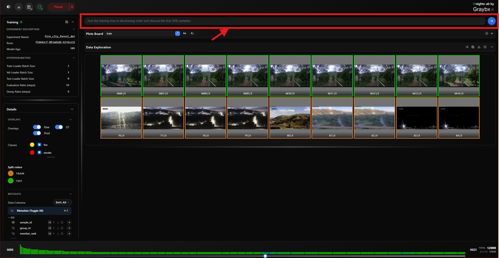
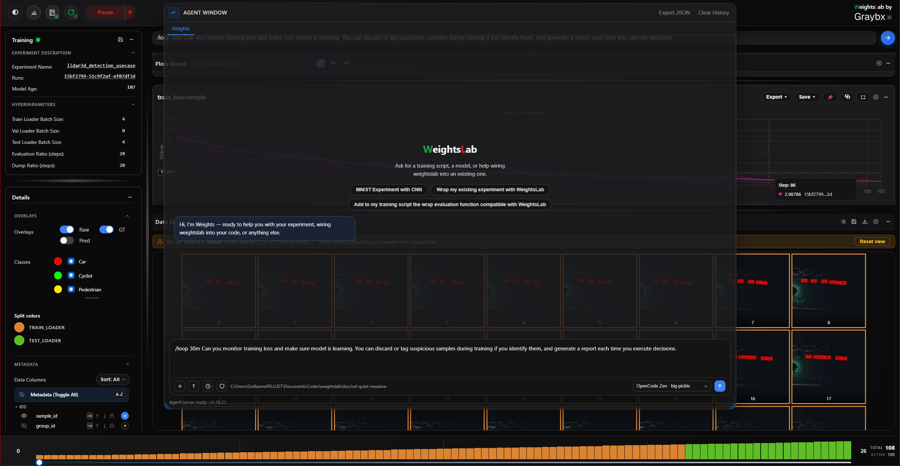

.. _studio-agent:

Agent
=====

.. warning:: Unstable — in active development

   The agent is **experimental**, and that applies to every surface on this
   page: the docked chat bar, the Agent Window, ``/loop`` jobs, and
   :ref:`report generation <studio-report-generation>`. Behaviour and results
   change between releases and vary with the connected model provider. Check
   what it did before relying on it, particularly for actions that modify data
   or the model — all of which are also available by hand through quick
   filters, the grid's context menu, the left panel, and the CLI console.

Weights Studio has a docked agent bar and an expandable, tabbed agent window.
Both are backed entirely by a local OpenCode server (`opencode.ai
<https://opencode.ai>`_) — see :doc:`../agent` for the full action list, and
for the distinction between this chat-bar agent and the separate
``/loop``/landing-page OpenCode agent.

The docked chat bar sits above the grid and is always available. Ask it in
plain language to sort the grid, tag or discard samples, analyse a signal, or
freeze or reset part of the model.

Agent Window
------------

Expanding the chat history opens a tabbed window:

- **Frontend Agent** — the main conversation, carried over from the landing
  page when the backend connected. Replies to the docked chat bar land in this
  same transcript, so there is one conversation rather than two.
- **One tab per running** ``/loop`` **job**, created when the job starts and
  closable when you're done with it.

The window also exports the conversation as JSON, and clears it.

Commands
--------

.. list-table::
   :header-rows: 1
   :widths: 24 76

   * - Command
     - What it does
   * - ``/init``
     - Connect to the OpenCode server and pick a model.
   * - ``/model``
     - Switch the active model.
   * - ``/reset``
     - Clear the current agent runtime connection and status.
   * - ``/clear``
     - Clear the conversation.
   * - ``/compact``
     - Compact the conversation so a long session keeps its context.
   * - ``/loop <minutes> <prompt>``
     - Run a prompt on a repeating interval as a background job — for example
       ``/loop 10 check whether train loss has plateaued and tag the worst
       samples``. ``/loop list`` shows the running jobs; ``/loop stop <id>``
       ends one.
   * - ``@reset``
     - Reset the grid to the full dataset.

``/loop`` jobs run against the local OpenCode server, not the gRPC agent, and
survive while you work elsewhere in the studio.

Setting it up
-------------

WeightsLab starts (or reuses) a local ``opencode serve`` process for you, so
there is normally nothing to configure before the agent is available. If the
backend is not connected to it yet, the studio shows the agent as unconfigured
and the input placeholder tells you to type ``/init``.

Typical setup:

1. Authenticate OpenCode once, if you haven't already: ``opencode auth login``
   (or the landing page's login modal) — OpenRouter, Anthropic, a local Ollama
   endpoint, anything OpenCode supports.
2. Start WeightsLab (``wl.serve(serving_grpc=True)``).
3. Start Weights Studio (``weightslab start``).
4. Ask questions in the agent bar, or type ``/init`` first to pick a specific
   model.

The ``/init`` flow itself:

1. Type ``/init`` in the agent input.
2. Weights Studio connects to the OpenCode server.
3. Select a model from the available model list.
4. Confirm to initialize the runtime connection.

.. tip::

   On a remote machine, the browser reaches the OpenCode server **directly**
   rather than through the studio's proxy — so its port has to be reachable
   too. See :ref:`studio-bridging`.

History behavior
----------------

- Command entries such as ``/init``, ``/model``, and ``/reset`` are shown on
  the user side of the history.
- Agent lifecycle events (connection setup, model changes, reset) are shown as
  separate log-style entries.
- A pinned instruction line at the top summarizes the available commands.
