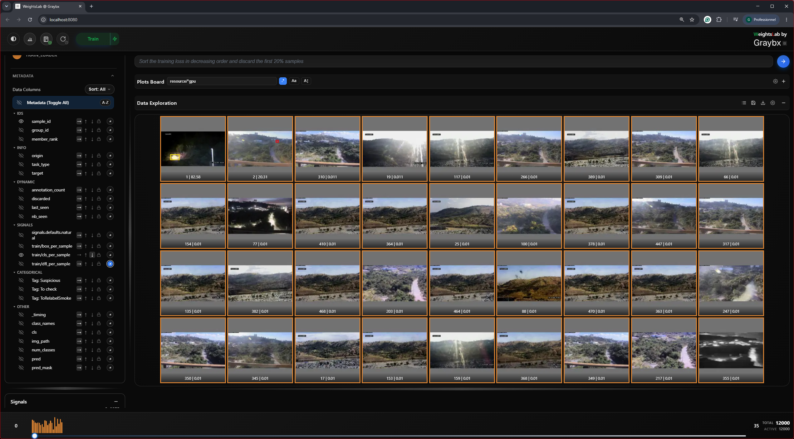
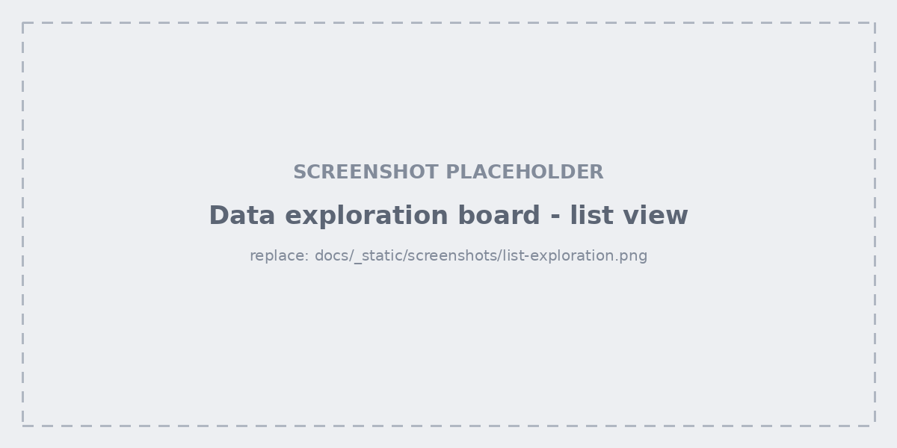
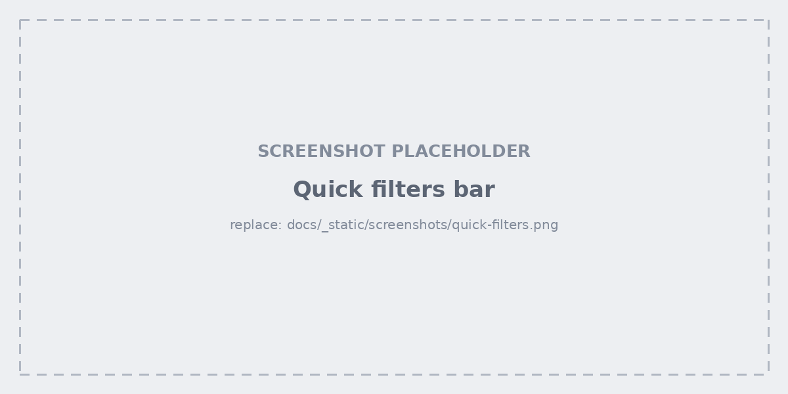
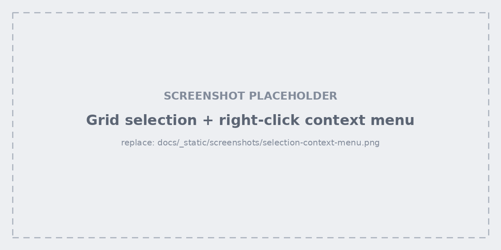
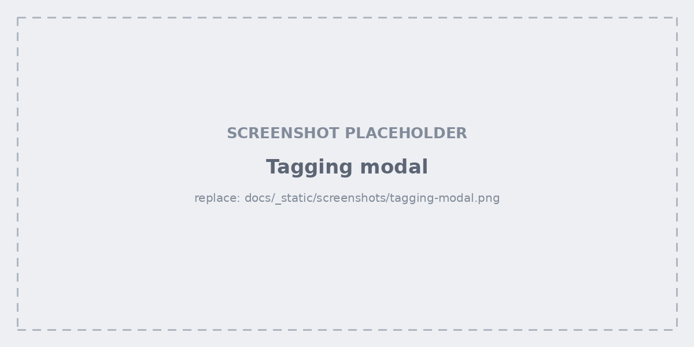
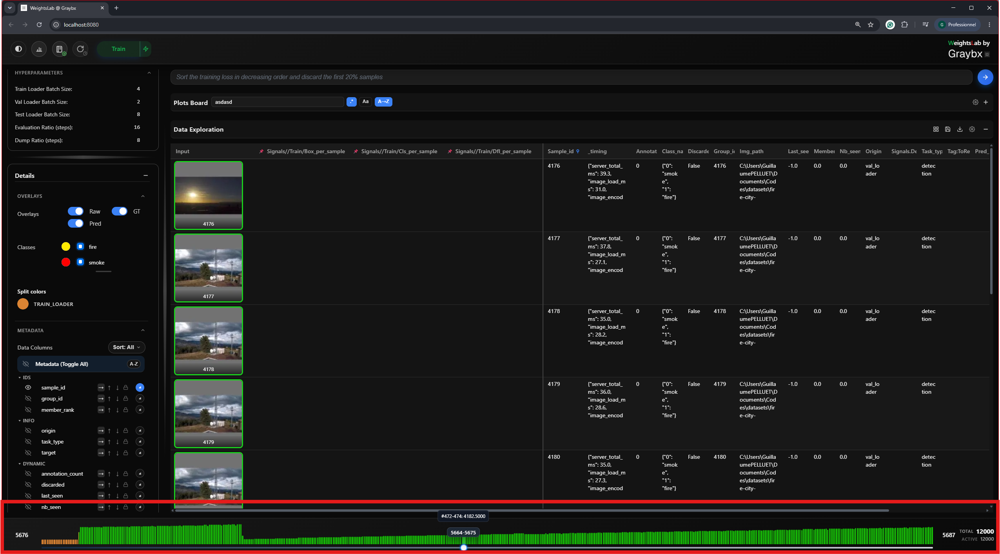

.. _studio-data-board:

Data exploration board
======================

Grid view
---------

One cell per sample: the image (with whichever overlays are enabled), the
metadata fields you selected, and a per-sample loss trajectory sparkline.
Click a cell to open the :ref:`studio-detail-modal`.

List view
---------

The same data as a table — one row per sample, a leading image column, and one
column per visible metadata field. This is the view for sorting and comparing
numbers rather than looking at pictures:

- **Click a column header** to sort — it cycles descending → ascending → off.
- **Click the lock icon** to pin a column so it survives later sorts.
- **Right-click a header** for clone, delete, reset, and histogram.
- **Click a row** to open that sample's detail modal.

Sort state is shared with the grid, so switching views never reshuffles what
you were looking at.

Quick filters
-------------

Filter and sort **without going through the agent** — no LLM in the loop, no
waiting. Build conditions from a column, an operator
(``==``, ``!=``, ``>``, ``<``, ``>=``, ``<=``, ``between``, ``contains``,
``has_tag``, ``not_has_tag``) and a value, stack several, and add a sort.

Use quick filters for the mechanical slices you already know you want
("loss > 2.0", "has_tag hard_examples") and the agent for the ones you'd
struggle to express as a predicate.

Subviews and reset
------------------

When a filter or an agent query narrows the grid, a banner reports how many
samples matched and the query behind them. **Reset** on that banner (or typing
``@reset`` in the agent bar) puts the grid back to the full dataset.

Selection and the context menu
------------------------------

- **Drag** a rectangle across cells to select a range.
- **Ctrl+click** to add or remove individual cells.
- **Right-click** the selection for the context menu: manage tags, discard
  samples, restore discarded ones.

Discarding removes samples from the model's active set without deleting
anything — the counter in the bottom bar shows *total* against *active*, and
a discard is always reversible.

Tagging modal
-------------

The full tag editor for a selection: existing tags, tags already on the
selection, quick-tag chips, and clear/cancel/apply. Use this when applying
several tags at once; use painter mode when applying one tag to many samples.

Bottom bar
----------

The batch slider walks through the dataset a page at a time, with the start and
end sample indices either side of it. On the right: **total available samples**
and **active samples used by the model** — the gap between them is exactly what
you have discarded.
