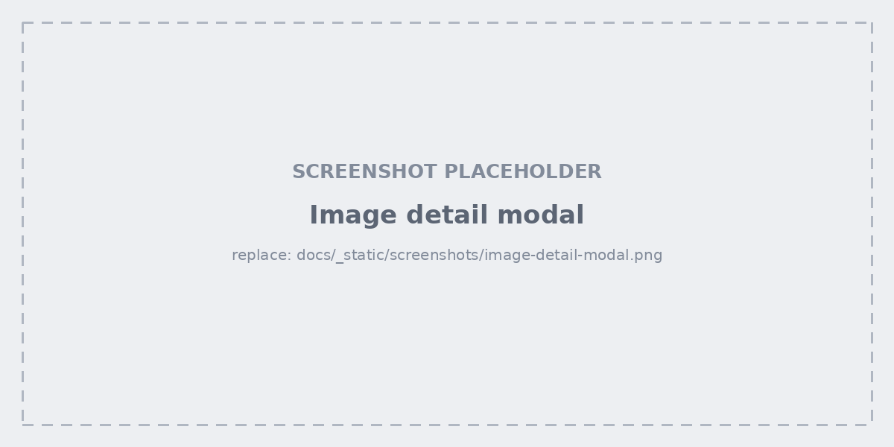
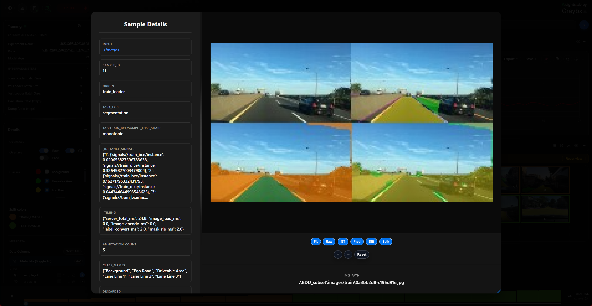
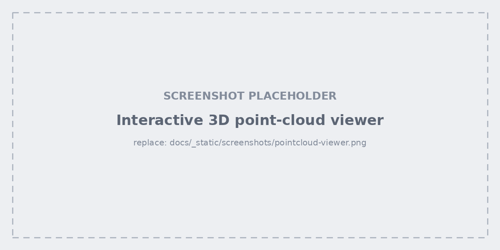
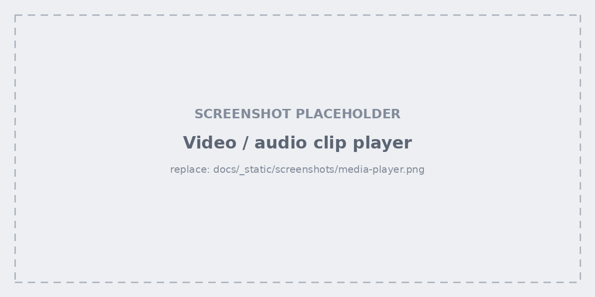

.. _studio-detail-modal:

Image detail modal
==================

Opened by clicking a grid cell or a list row.

- **Navigate** with the previous/next buttons or the ``←`` / ``→`` keys —
  you can walk a whole filtered subview without going back to the grid.
- **Zoom** in, out, reset, or fit to the pane.
- The **metadata panel** beside the image lists every field for the sample,
  and the pane divider can be dragged to give either side more room.

Overlays
========

Independent toggles for **raw**, **ground truth**, **prediction**, plus two
comparison modes:

- **diff** — ground truth against prediction in one image.
- **split** — the two side by side.

For detection runs, a bounding-box info control reports what is drawn; the
number of boxes rendered is capped by ``BB_MODAL_RENDER`` (and
``BB_THUMB_RENDER`` for thumbnails).

Point clouds, video and text
============================

The modal adapts to the sample's modality.

**Point clouds** open in an interactive 3D viewer — orbit, zoom, and expand it
to fill the screen. Cap the rendered points with ``PC_MAX_POINTS`` on very
dense scans.

**Video and audio clips** get a player with frame-by-frame stepping and a
frame slider, so you can land on the exact frame a signal spiked on.

**Volumetric images** get a Z-slice slider, and **text samples** render as
text rather than as an image.
