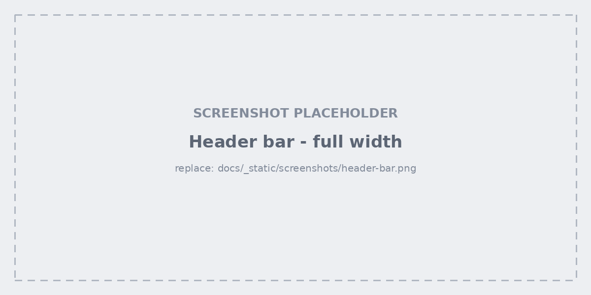
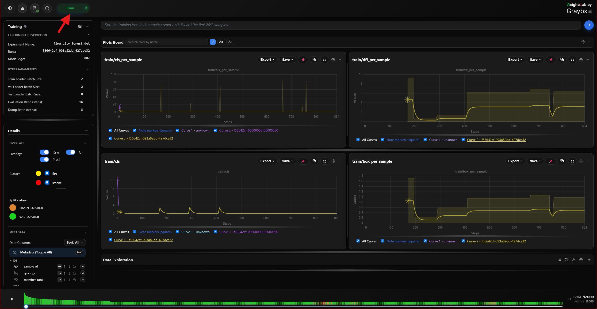
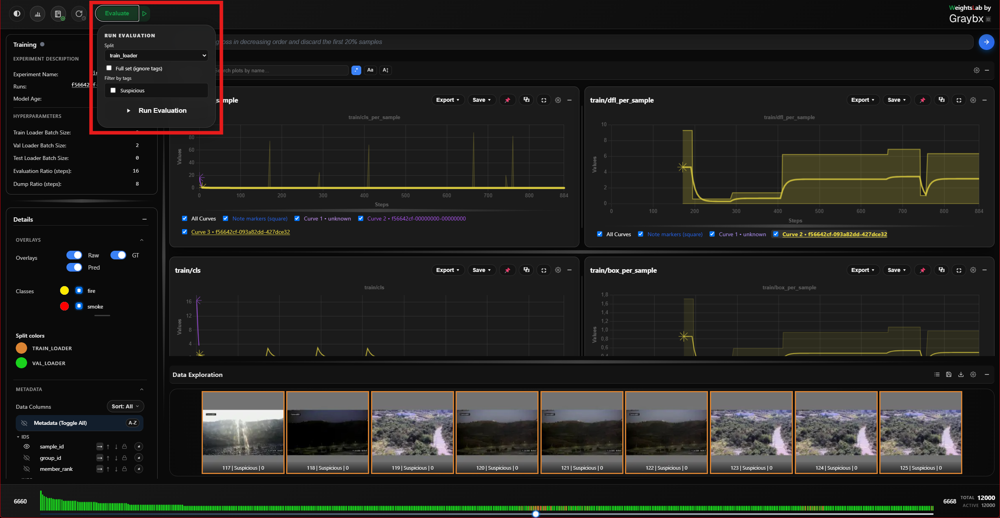
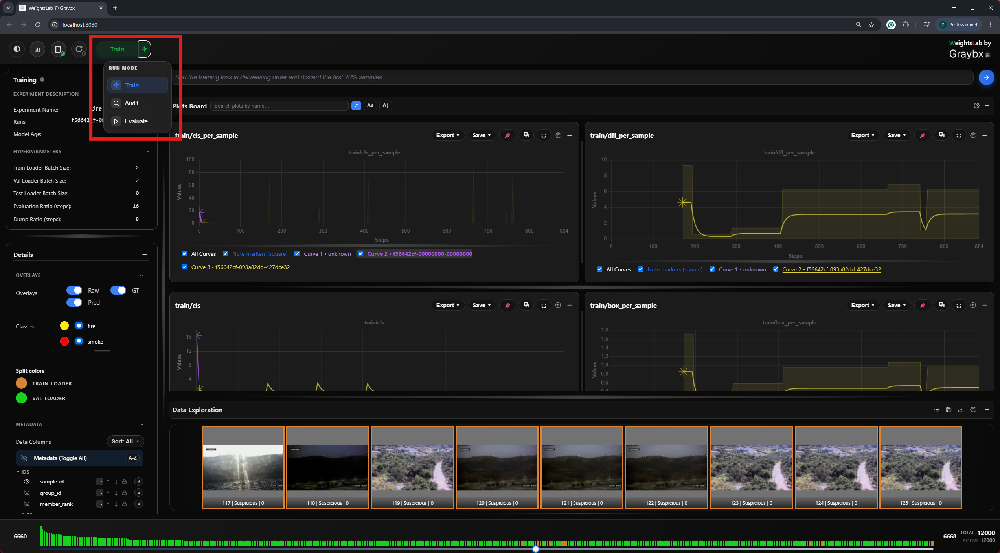
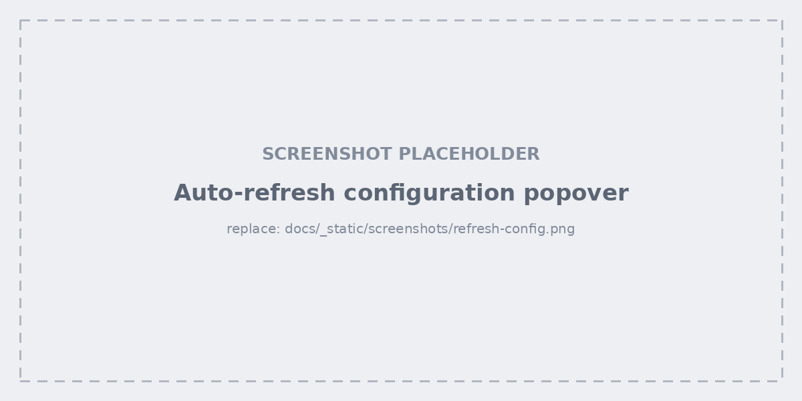

.. _studio-header:

Header bar
==========

Left to right, the header carries every session-wide control.

Training: Pause and Resume
--------------------------

Toggles ``is_training`` on the backend. Pausing stops the training loop but
leaves the process, the notebook kernel and the agent alive — this is the
correct way to stop for a while (see :ref:`good-practice-open-ended-loop`).

Next to it, the **save-weights** button pauses training and forces a
checkpoint dump. **Right-click it** to also save the architecture alongside
the weights.

.. tip::

   Data-modifying actions (discarding, retagging, editing hyperparameters)
   pause training automatically before they apply, then resume. You don't have
   to pause by hand first.

Run Evaluation
--------------

Triggers an evaluation pass on demand:

1. Pick the **split** — ``train_loader`` or ``test_loader``.
2. Either leave **Full set (ignore tags)** checked, or uncheck it and pick the
   tags to restrict the pass to a subset.
3. Click **Run Evaluation**. A status line reports progress and completion.

Evaluating a tagged subset is the fast path for "did my fix actually help the
samples I flagged?" — tag the bad ones, run eval on just that tag, compare.

Mode selector: train / audit / eval
-----------------------------------

- **train** — the normal loop.
- **audit** — inspect-only; data edits are recorded for review rather than
  applied blind.
- **eval** — the evaluation pass configured above.

Auto-refresh and cache
----------------------

**Refresh now** re-pulls the stats for the currently visible grid cells. The
popover next to it configures the two refresh loops independently:

- **Data auto-refresh** — on/off plus an interval, for the grid and its stats.
- **Plot auto-refresh** — on/off plus an interval, for the signal plots.
- **Clear cache and reload** — drops cached images and metadata, then reloads
  the page. Reach for this when thumbnails look stale after a data edit.

On a large dataset, turning data auto-refresh **off** while you work through a
selection keeps the grid from re-fetching under you.

Notebook and report buttons
---------------------------

Two buttons sit left of the logo, both disabled until a backend connects:

- **Notebook** — opens the :ref:`embedded-notebook`.
- **Report** — generates an experiment report; see
  :ref:`studio-report-generation`.

A third indicator reports the status of a **local Jupyter** server started
from the landing page, with a menu to reopen it.

Dark mode
---------

Switches the whole studio between light and dark themes. The choice persists
across reloads.
