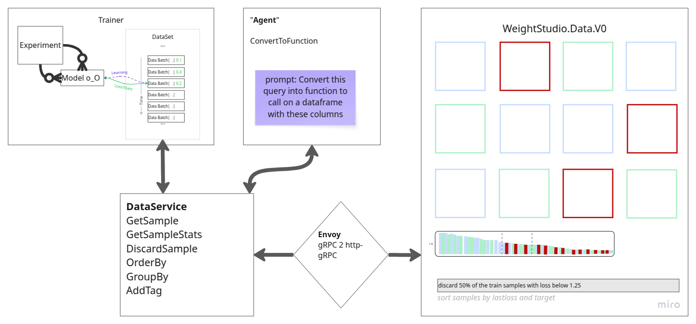

Weights Studio Guide
====================

Weights Studio is the visual frontend for WeightsLab experiments.
It ships **inside the Python package**.
Running ``weightslab start`` serves the bundled SPA and proxies gRPC-Web to
your training backend, all from one Python process.

Architecture
------------

Runtime path:

1. Browser (served from ``weightslab start``)
2. ``weightslab start`` — pure-Python HTTP server that:

   - Serves the pre-built Weights Studio SPA (vendored in ``weightslab/ui/static/``)
   - Translates gRPC-Web (browser) to raw gRPC (backend) via an embedded proxy

3. WeightsLab Python gRPC service (started by ``wl.serve()``)

Quick start
-----------

1. Install WeightsLab::

     pip install weightslab

2. In your training script, start the backend::

     import weightslab as wl
     wl.serve(serving_grpc=True)
     # ... training loop ...
     wl.keep_serving()

3. In another terminal, start the UI::

     weightslab start

4. Open the URL printed by ``weightslab start`` in your browser.

The UI auto-discovers the backend on ``localhost:50051`` (default).
Pass ``--backend-port`` to override::

    weightslab start --backend-port 50052

To suppress auto-opening the browser::

    weightslab start --no-browser

.. _studio-features:

Sections
--------

Setup and access
~~~~~~~~~~~~~~~~

.. toctree::
   :maxdepth: 0

   ports
   security
   configuration
   deployment

Feature reference
~~~~~~~~~~~~~~~~~

Everything the studio puts on screen, what it is for, and how to drive it.

.. toctree::
   :maxdepth: 0

   landing_page
   header_bar
   left_panel
   data_board
   detail_modal
   plots
   resource_monitoring
   agent
   notebook
   reports

Operating it
~~~~~~~~~~~~

.. toctree::
   :maxdepth: 0

   cli_console
   troubleshooting
