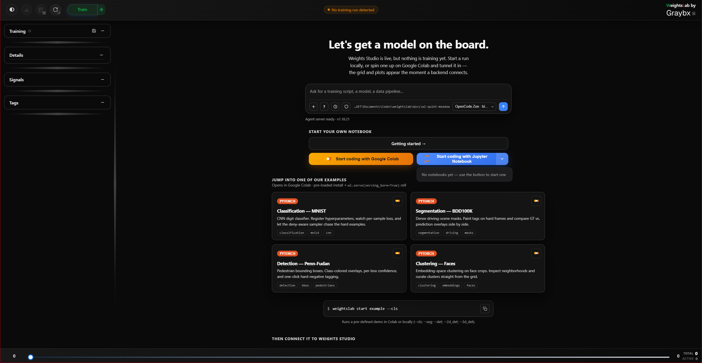

.. _studio-landing-page:

Landing page
============

Until a training backend connects, the studio shows a landing page instead of
the (empty) boards. It is a working surface in its own right, not a splash
screen:

- **Agent chat** — a full OpenCode chat that needs no backend at all. Ask it
  to scaffold a training script, wire ``wl.serve()`` into an existing one, or
  explain a WeightsLab concept. It runs in your experiment directory, so it
  can read and write files there.
- **Local Jupyter Notebook** — starts a real, standalone ``jupyter notebook``
  server and opens it. The button also **lists notebooks already in this
  run's** ``notebooks/`` **directory**, so you can reopen one instead of
  creating a new one each time. Distinct from the in-app
  :ref:`embedded-notebook`, which requires a live backend.
- **Colab quickstarts** — per-topic notebooks that install WeightsLab from
  PyPI and call ``wl.serve(serving_bore=True)``, so a Colab runtime can drive
  a studio on your machine.

The moment a backend connects, this page is replaced by the boards and the
landing agent's conversation is carried over into the Agent Window — you don't
lose the thread.
