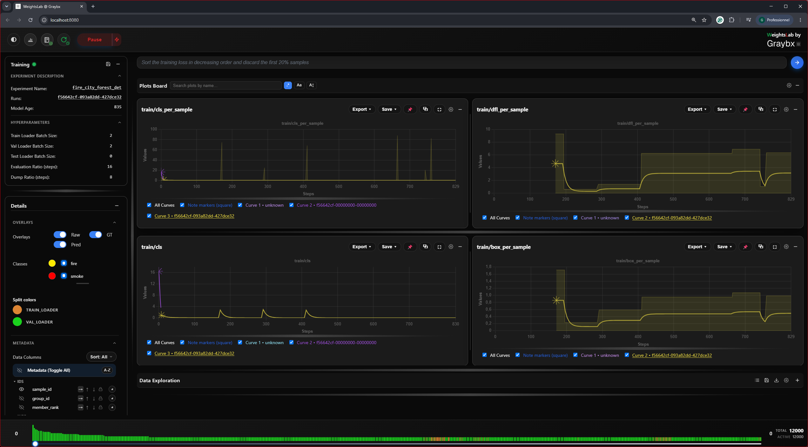
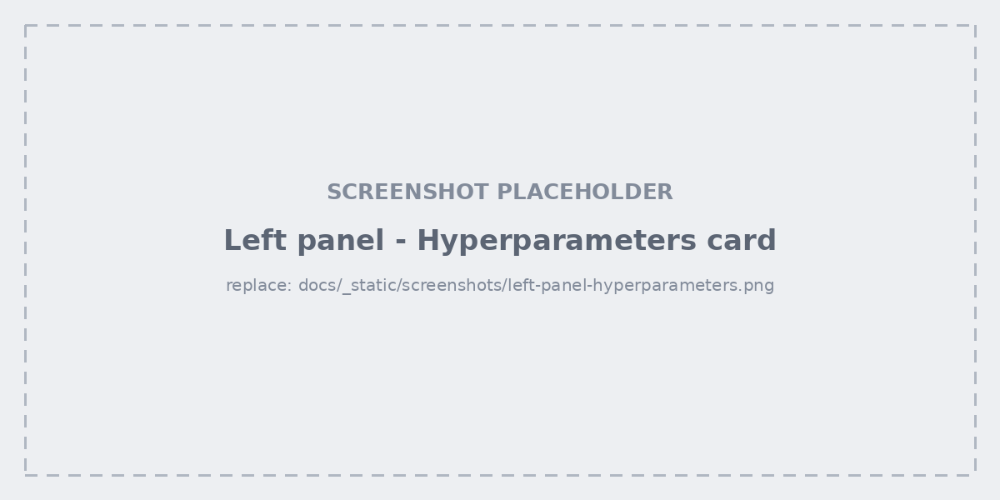
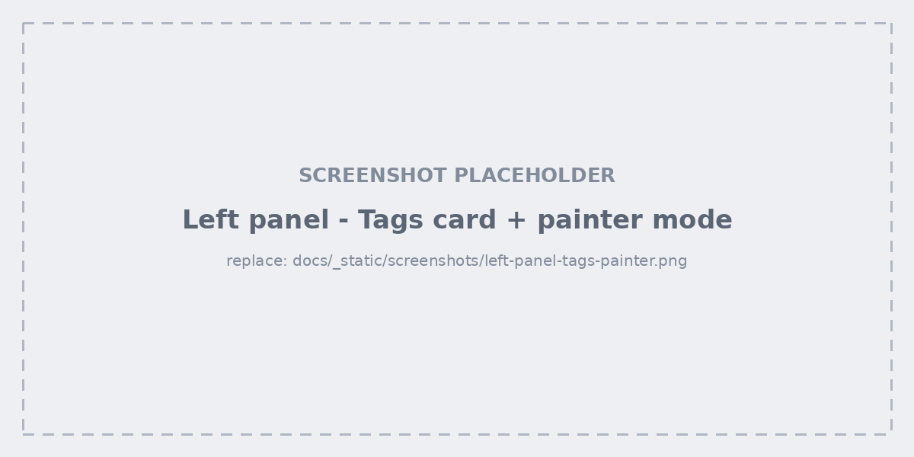
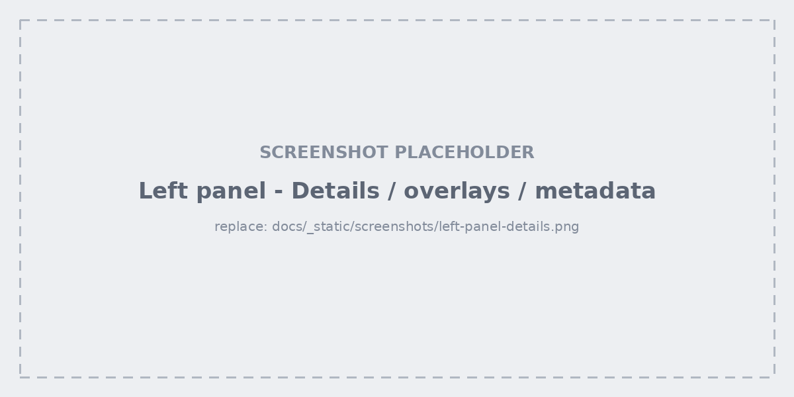

.. _studio-left-panel:

Left panel
==========

The left panel stacks the experiment's controls. Every card collapses
individually with the button in its header, and the panel itself can be
resized by dragging its inner edge — useful when a metadata list gets long.

Training card
-------------

The state pill (training / paused), the backend connection status, and the
live metrics for the current step. Below it, the **experiment description**
gives the run's name, its configuration hash, and its age — the fastest way to
confirm the tab you're looking at is the run you think it is.

Hyperparameters
---------------

Live, editable hyperparameters — training batch size, validation and test
batch sizes, learning rate, evaluation frequency, and checkpoint frequency.
Each row shows the **requested** value next to the **applied** one, so you can
see a change land rather than assume it did.

Edits take effect on the running experiment. Set
``ENABLE_HYPERPARAMETERS_OPTIMIZATION=0`` to render them read-only.

Tags and painter mode
---------------------

Create tags, then apply them to samples. Two ways:

- **Selection-based** — select cells in the grid, right-click, apply a tag.
- **Painter mode** — toggle the painter, pick a tag chip, then click or drag
  across grid cells to paint the tag straight onto them. The **Add / Remove**
  switcher decides whether painting applies or strips the tag.

Painter mode is what makes labelling a few hundred samples by eye tolerable:
no modal, no round trip, just drag.

Details, overlays and metadata
------------------------------

- **Grid settings** — cell size and image resolution. Lower the resolution
  percentage on a big dataset: the grid renders far faster and the detail
  modal still loads full resolution.
- **Overlays** — toggle **raw**, **ground truth**, and **prediction** layers
  on every thumbnail at once. Segmentation runs get a per-class list so
  individual classes can be shown or hidden.
- **Train / eval colours** — the accent colours distinguishing train samples
  from eval samples in the grid.
- **Metadata fields** — choose which columns appear on cells and as columns in
  the list view. Each field can also be turned into a histogram.

Data actions
------------

- **Manual save** — writes the current data state (tags, discards) to disk
  immediately rather than waiting for the next automatic save.
- **Export annotations** — exports bounding boxes and segmentation masks to
  CVAT, Label Studio, or V7 for relabelling.

  .. figure:: ../_static/screenshots/export-annotations.png
     :alt: Export annotations dialog
     :width: 100%

  See :doc:`../export` for the formats and the round trip back.
