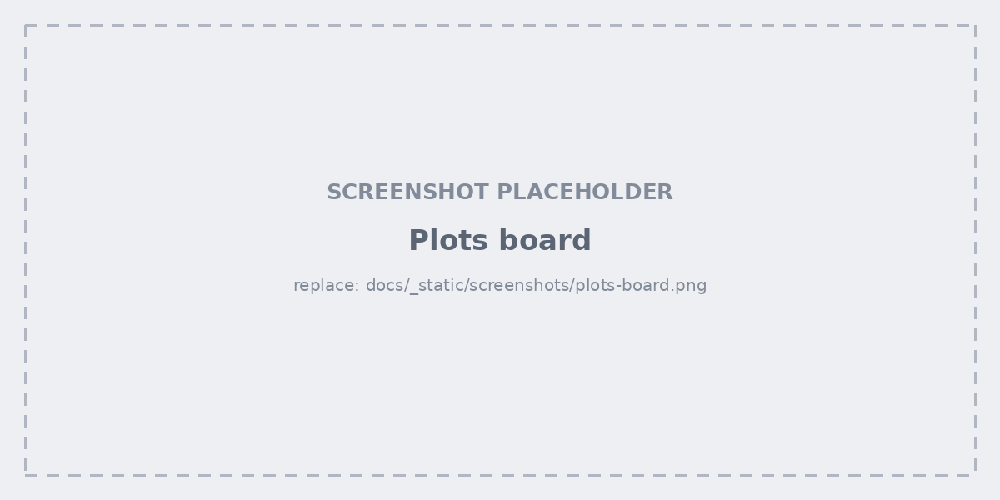
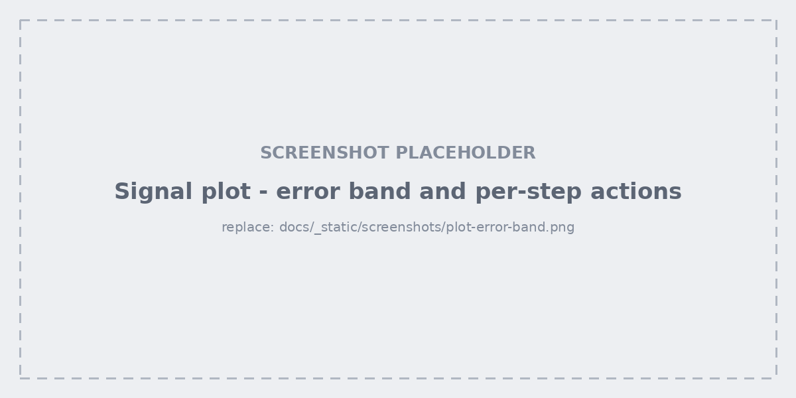
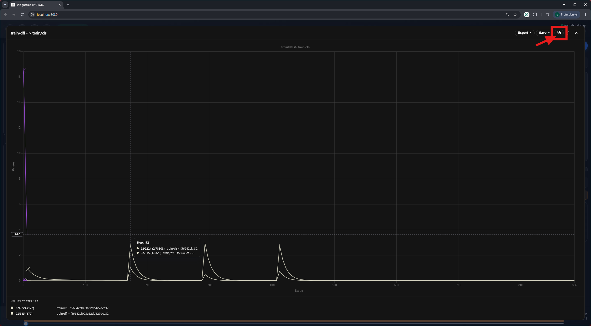
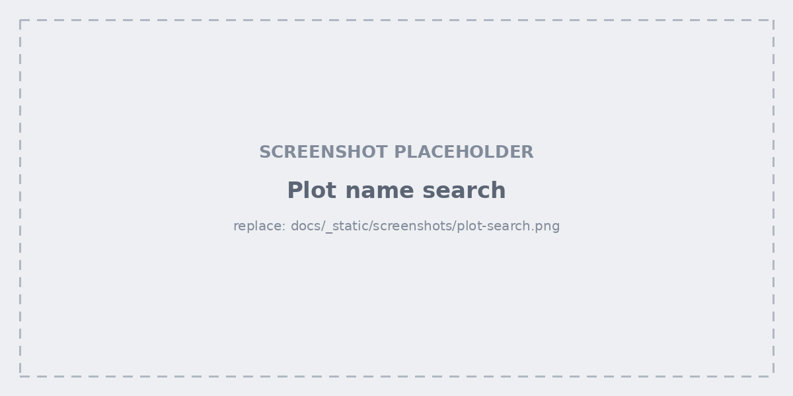

.. _studio-plots:

Plots board
===========

One card per signal, laid out in a resizable board. Per card: reset zoom,
export to CSV or JSON, and a settings menu for curve colour, smoothing, the
standard-deviation band, and markers. Right-click a plot for reset zoom, curve
colour, **load weights at this step**, hide/show a curve, break by slices, and
copy or save the chart as an image.

Error band and per-step actions
-------------------------------

Each point on a curve is the **mean** of that step's batch. The band around it
is not a standard deviation — it is the batch's **actual lowest and highest
sample values**. A step containing one bad outlier makes the band spike out to
it, so the anomaly becomes *more* visible rather than being smoothed away.

From a point on the curve:

- **Highlight step samples** — filters the data grid to the whole batch behind
  that point, so you can look at what produced the spike.
- **Save step snapshot** — freezes that step's per-sample values into their own
  metadata column. Worth knowing: per-sample metadata otherwise only holds the
  *latest* value logged for a sample, so a spike from several epochs ago is
  unrecoverable by the time you notice it. Snapshot it before you move on.

Merged comparison plots
-----------------------

Merge two signals onto one chart to compare them directly; the merged card is
titled ``A <> B``. Merges compose — merging again gives ``A <> B <> C``, with
no nesting and no limit.

Merged plots are a **UI-only** construct: the backend never hears about them,
nothing is persisted server-side, and removing one leaves the source signals
untouched.

Searching the board
-------------------

Search lives in the plots board header:

- **While typing** — a centred popup previews the matching plots. The real
  cards are *moved* into it, so the preview is live; closing it puts every card
  back exactly where it was.
- **On Enter** — the popup closes and the board reorders itself with matches
  first. Nothing is hidden.

Two inline toggles control matching: **Aa** for case sensitivity and **Reg**
for regex (on by default, so ``loss|grad`` finds either). With regex off, ``|``
still separates alternatives but each is matched literally.
