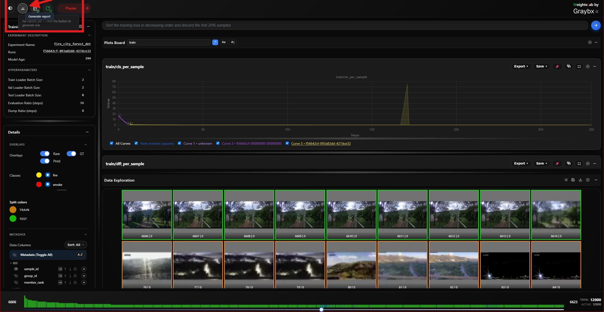

.. _studio-report-generation:

Experiment report generation
============================

.. warning:: Unstable — in active development

   Report generation from Weights Studio is **experimental**. Its output,
   the button's behaviour, and the on-disk layout of generated reports are
   all still changing, and it can fail or produce an incomplete report on
   some experiments — particularly ones with unusual signal shapes, very
   long histories, or no authenticated agent provider.

   Treat what it produces as a **draft to read**, not as an artifact to
   archive, publish, or cite. Don't build anything on the file paths or the
   HTML structure yet. If you need a report you can rely on today, generate
   it from Python or the CLI (:doc:`../experiment_reports`), which exercise the
   same pipeline with arguments you control.

   Please do report what breaks — that feedback is what stabilises it.

The **report button** sits in the header, immediately left of the notebook
button, and is disabled until a backend connects.

Generating a report
===================

**Left-click** it. This sends the same request the chat bar would — "Generate
an experiment report" — through the normal agent pipeline. There is no
dedicated RPC behind the button, which is why everything that applies to the
agent applies here too: a provider must be authenticated, and generation takes
as long as the model takes.

Progress appears in the status bar and the request shows up as an ongoing task
while it runs. The finished report is written under
``<root_log_dir>/reports/``.

Browsing existing reports
==========================

**Right-click** the button to list the reports already on disk for this
experiment, newest first, and open one. That listing is served over plain
same-origin HTTP by ``weightslab start`` — browsing and opening a report never
touches gRPC or the agent, so it keeps working even when generation doesn't.

What lands in the report
=========================

The same artifact the other entry points produce: per-signal trajectory plots
with an automatic health classification, bounded per-sample outliers, dataset
statistics (sample counts, discard rate, tag distribution), and a written
analysis grounded in those numbers — as one self-contained HTML file.

See :doc:`../experiment_reports` for the full description, and for the Python
(:func:`ai_report_generation`) and CLI (``report``) entry points.

Known rough edges
==================

- Generation is a single long agent turn: there is no partial output and no
  resume if it fails midway. Re-run it.
- Signals with very short histories can be classified misleadingly — the
  health verdict assumes enough points to establish a trend.
- The button offers no options. Use the Python or CLI entry points when you
  need to pick specific signals, an output path, distributions, or to skip the
  LLM analysis with ``--no-agent``.
- Reports are not cleaned up automatically; ``<root_log_dir>/reports/`` grows
  until you prune it.
