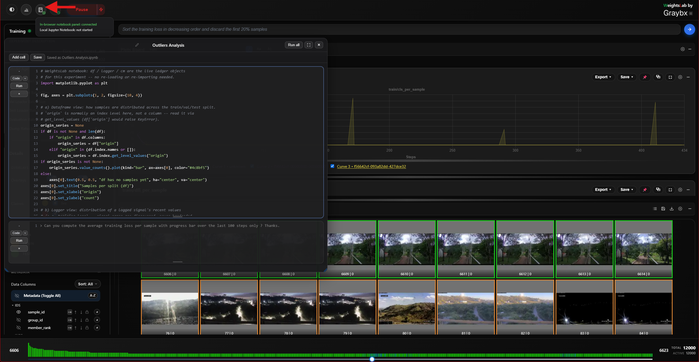

.. _studio-landing-page:

Landing page
============

.. figure:: ../_static/screenshots/landing-page.png
   :alt: Weights Studio landing page shown when no backend is connected
   :width: 100%

Until a training backend connects, the studio shows a landing page instead of
the (empty) boards. It is a working surface in its own right, not a splash
screen:

- **Agent chat** — a full OpenCode chat that needs no backend at all. Ask it
  to scaffold a training script, wire ``wl.serve()`` into an existing one, or
  explain a WeightsLab concept. It runs in your experiment directory, so it
  can read and write files there.
- **Local Jupyter Notebook** — starts a real, standalone ``jupyter notebook``
  server and opens it. The button also **lists notebooks already in this
  run's** ``notebooks/`` **directory**, so you can reopen one instead of
  creating a new one each time. Distinct from the in-app
  :ref:`embedded-notebook`, which requires a live backend.
- **Colab quickstarts** — per-topic notebooks that install WeightsLab from
  PyPI and call ``wl.serve(serving_bore=True)``, so a Colab runtime can drive
  a studio on your machine.

The moment a backend connects, this page is replaced by the boards and the
landing agent's conversation is carried over into the Agent Window — you don't
lose the thread.

.. _studio-report-generation:

Report Generation
------------------

.. warning:: Unstable — in active development

   Report generation from Weights Studio is **experimental**. Its output,
   the button's behaviour, and the on-disk layout of generated reports are
   all still changing, and it can fail or produce an incomplete report on
   some experiments — particularly ones with unusual signal shapes, very
   long histories, or no authenticated agent provider.

   Treat what it produces as a **draft to read**, not as an artifact to
   archive, publish, or cite. Don't build anything on the file paths or the
   HTML structure yet. If you need a report you can rely on today, generate
   it from Python or the CLI (:doc:`../experiment_reports`), which exercise the
   same pipeline with arguments you control.

   Please do report what breaks — that feedback is what stabilises it.

.. figure:: ../_static/screenshots/report-button.png
   :alt: The experiment report button and the list of previously generated reports
   :width: 100%

The **report button** sits in the header, immediately left of the notebook
button, and is disabled until a backend connects.

Generating a report
~~~~~~~~~~~~~~~~~~~~

**Left-click** it. This sends the same request the chat bar would — "Generate
an experiment report" — through the normal agent pipeline. There is no
dedicated RPC behind the button, which is why everything that applies to the
agent applies here too: a provider must be authenticated, and generation takes
as long as the model takes.

Progress appears in the status bar and the request shows up as an ongoing task
while it runs. The finished report is written under
``<root_log_dir>/reports/``.

Browsing existing reports
~~~~~~~~~~~~~~~~~~~~~~~~~~

**Right-click** the button to list the reports already on disk for this
experiment, newest first, and open one. That listing is served over plain
same-origin HTTP by ``weightslab start`` — browsing and opening a report never
touches gRPC or the agent, so it keeps working even when generation doesn't.

What lands in the report
~~~~~~~~~~~~~~~~~~~~~~~~~

The same artifact the other entry points produce: per-signal trajectory plots
with an automatic health classification, bounded per-sample outliers, dataset
statistics (sample counts, discard rate, tag distribution), and a written
analysis grounded in those numbers — as one self-contained HTML file.

See :doc:`../experiment_reports` for the full description, and for the Python
(:func:`ai_report_generation`) and CLI (``report``) entry points.

Known rough edges
~~~~~~~~~~~~~~~~~~

- Generation is a single long agent turn: there is no partial output and no
  resume if it fails midway. Re-run it.
- Signals with very short histories can be classified misleadingly — the
  health verdict assumes enough points to establish a trend.
- The button offers no options. Use the Python or CLI entry points when you
  need to pick specific signals, an output path, distributions, or to skip the
  LLM analysis with ``--no-agent``.
- Reports are not cleaned up automatically; ``<root_log_dir>/reports/`` grows
  until you prune it.

.. _embedded-notebook:

Integrated Notebooks
---------------------

Weights Studio has a Jupyter-like notebook panel built into the UI itself,
opened via the notebook button just left of the logo. Unlike a standalone
Jupyter server, it runs in a **shared in-process kernel inside the training
backend** — every cell sees the exact same live objects your training script
does (the tracked dataframe ``df``, the model, optimizers, checkpoints), with
no serialization or IPC in between.

.. note::

   This is a different feature from the **Local Jupyter Notebook** button on
   the "no backend connected" landing page above, which launches a real,
   standalone ``jupyter notebook`` server process instead. Use the embedded
   panel below to interact with an experiment that's already training; use
   the landing-page button to bootstrap a brand-new experiment from a
   notebook before any backend exists at all.

How it works
~~~~~~~~~~~~~

- The button is disabled until a backend connects, then becomes clickable.
- The notebook document persists as ``notebook.ipynb`` under the experiment's
  ``root_log_dir``. Reopening the panel — even after restarting the UI,
  as long as it points at the same experiment — reloads the same cells,
  their source, and their last-run outputs.
- Every cell runs against the training process's ONE shared kernel: only one
  cell executes at a time. Clicking Run on a second cell while another is
  still running queues it rather than firing a second concurrent execution.
- Running a code cell streams its output live as it's produced: stdout/stderr
  (merged, in order), the value of the last expression, any ``matplotlib``
  figures rendered inline as images, and a full traceback on error.
- A run can be interrupted mid-flight with the stop button next to the cell.

Cell types
~~~~~~~~~~~

Cells can be **code** or **markdown** — toggle a cell's type with the small
button in its gutter:

- **Code cells** execute against the shared kernel as described above.
- **Markdown cells** render to formatted HTML (headings, bold/italic, lists,
  links, blockquotes, fenced code) when run. Double-click the rendered view
  (or run the cell again) to drop back into the raw source for editing.

Asking the agent for code
~~~~~~~~~~~~~~~~~~~~~~~~~~

A cell whose source starts with ``>`` is not executed as Python — it's sent
to the AI agent as a natural-language request for code:

.. code-block:: text

   > Compute the average training loss per sample over the last 100 steps,
   > with a progress bar.

The agent's proposed code replaces the cell's contents; review it, then run
it like any other cell. Press Enter at the end of a ``>`` line to continue
the same prompt onto a new line; press Enter again on an empty ``>`` line to
drop the marker and finish the prompt. Any plain code left in the same cell
below the ``>`` lines is sent to the agent as extra context, not executed.

If a cell's last run raised an error, an **"AI" debug button** appears on its
output — click it to send the code and traceback back to the agent and ask
for a fix, without retyping it as a ``>`` prompt yourself.

Example
~~~~~~~~

A typical first cell against a live experiment:

.. code-block:: python

   df.head()

Followed by, in a second cell:

.. code-block:: text

   > Plot a histogram of the per-sample loss for the current epoch,
   > highlighting samples tagged "hard_examples" in red.

Running that second cell doesn't execute anything yet — it fills the cell
with the agent's generated ``matplotlib`` code, which you then run to see
the plot rendered inline in the cell's output.

Saving and running everything
~~~~~~~~~~~~~~~~~~~~~~~~~~~~~~

- **Save**: writes the current notebook (source + outputs) to
  ``notebook.ipynb``. This also happens automatically right after any cell
  finishes running (a code execution or a markdown render), so you rarely
  need to click it by hand.
- **Run all**: runs every cell top to bottom, strictly one at a time (never
  concurrently), skipping ``>``-prefixed agent-prompt cells; saves once more
  when the whole pass finishes.
- **Rename**: renaming picks a non-colliding filename automatically if one
  already exists.

Window controls
~~~~~~~~~~~~~~~~

The notebook opens as a floating, draggable window: drag its header to move
it, drag an edge or corner to resize, or use the maximize button to fill the
viewport and restore it back to its previous size and position.

Turning it off
~~~~~~~~~~~~~~~

Set ``ENABLE_NOTEBOOK=0`` before ``weightslab start`` to remove both the
button and the window entirely (dev server: ``VITE_ENABLE_NOTEBOOK`` — see
the *Frontend runtime feature toggles* table in :doc:`more/configuration`).
