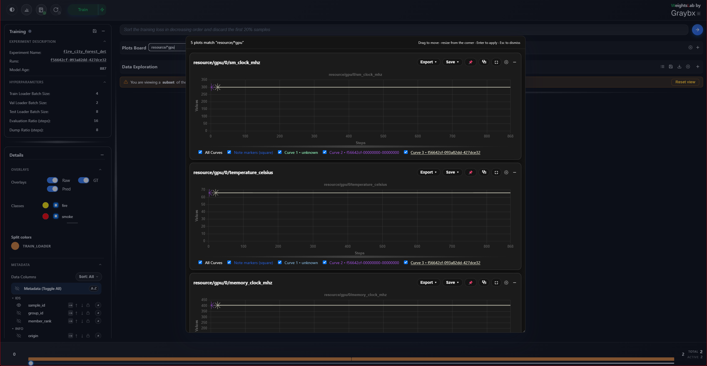

.. _studio-main-area:

Main area
=========

The main area is the boards themselves — plots on one side, the data grid on
the other — plus everything you can open from them (the detail modal, quick
filters, selections).

.. _studio-plots:

Plots Board
-----------

.. figure:: ../_static/screenshots/plots-board.png
   :alt: Plots board with several signal cards
   :width: 100%

One card per signal, laid out in a resizable board. Per card: reset zoom,
export to CSV or JSON, and a settings menu for curve colour, smoothing, the
standard-deviation band, and markers.

Right click actions details
~~~~~~~~~~~~~~~~~~~~~~~~~~~~

Right-click a plot for: reset zoom, curve colour, **load weights at this
step**, hide/show a curve, break by slices, and copy or save the chart as an
image.

Error-band details
~~~~~~~~~~~~~~~~~~~

.. figure:: ../_static/screenshots/plot-error-band.png
   :alt: Signal plot showing the error band around the mean curve
   :width: 100%

Each point on a curve is the **mean** of that step's batch. The band around it
is not a standard deviation — it is the batch's **actual lowest and highest
sample values**. A step containing one bad outlier makes the band spike out to
it, so the anomaly becomes *more* visible rather than being smoothed away.

From a point on the curve:

- **Highlight step samples** — filters the data grid to the whole batch behind
  that point, so you can look at what produced the spike.
- **Save step snapshot** — freezes that step's per-sample values into their own
  metadata column. Worth knowing: per-sample metadata otherwise only holds the
  *latest* value logged for a sample, so a spike from several epochs ago is
  unrecoverable by the time you notice it. Snapshot it before you move on.

Signals curves merged
~~~~~~~~~~~~~~~~~~~~~~

.. figure:: ../_static/screenshots/plot-merge.png
   :alt: A merged comparison plot drawing two signals on one chart
   :width: 100%

Merge two signals onto one chart to compare them directly; the merged card is
titled ``A <> B``. Merges compose — merging again gives ``A <> B <> C``, with
no nesting and no limit.

Merged plots are a **UI-only** construct: the backend never hears about them,
nothing is persisted server-side, and removing one leaves the source signals
untouched.

Signals curves search
~~~~~~~~~~~~~~~~~~~~~~

.. figure:: ../_static/screenshots/plot-search.png
   :alt: Plot name search with live preview
   :width: 100%

Search lives in the plots board header:

- **While typing** — a centred popup previews the matching plots. The real
  cards are *moved* into it, so the preview is live; closing it puts every card
  back exactly where it was.
- **On Enter** — the popup closes and the board reorders itself with matches
  first. Nothing is hidden.

Two inline toggles control matching: **Aa** for case sensitivity and **Reg**
for regex (on by default, so ``loss|grad`` finds either). With regex off, ``|``
still separates alternatives but each is matched literally.

.. _studio-resource-monitoring:

Resource monitoring signals
~~~~~~~~~~~~~~~~~~~~~~~~~~~~

WeightsLab samples CPU, memory, disk, network, GPU and process usage in the
background for the whole life of the backend, and logs every value through the
**same signal pipeline as your losses and metrics**. There is no separate
dashboard: the curves land in the plots board like any other signal, named
with a ``resource/`` prefix. This is on by default and needs no setup.

Type ``resource/`` into the plots board search above to pull every resource
curve to the front of the board. Narrow it from there — ``resource/gpu`` for
the accelerators, ``resource/process`` for the backend process itself, or
``resource/gpu|resource/memory`` to compare both at once (search is regex by
default).

The signals, by category:

.. list-table::
   :header-rows: 1
   :widths: 18 82

   * - Category
     - Signals
   * - ``cpu``
     - ``resource/cpu/utilization_percent``
   * - ``memory``
     - ``resource/memory/system_utilization_percent``
   * - ``disk``
     - ``resource/disk/utilization_percent``, ``…/utilization_gb``,
       ``…/read_mb``, ``…/written_mb``
   * - ``network``
     - ``resource/network/bytes_sent``, ``…/bytes_received``
   * - ``process``
     - ``resource/process/cpu_utilization_percent``, ``…/cpu_threads_in_use``,
       ``…/memory_in_use_mb``, ``…/memory_in_use_percent``,
       ``…/memory_available_mb``
   * - ``gpu``
     - ``resource/gpu/<index>/memory_clock_mhz``, ``…/sm_clock_mhz``,
       ``…/memory_allocated_bytes``, ``…/memory_allocated_percent``,
       ``…/temperature_celsius`` — one full set **per device**

Reading them next to your own curves:

- **Merge** a resource curve with a training signal
  (``resource/gpu/0/memory_allocated_percent <> train_loss``) and read them on
  one chart. A batch-size change that moved GPU memory and a loss that moved at
  the same step line up visually.
- Resource curves **restart at 0 when training does**, so they stay comparable
  across restarts instead of carrying on from wherever process uptime had
  reached.
- While training is paused the model's age doesn't move, so samples don't stack
  into a vertical smear at one x — the curve simply waits.

Set ``WL_RESOURCE_MONITOR_STEP_SOURCE=seconds`` to plot against elapsed seconds
since the monitor started instead. Useful when you care about wall-clock
behaviour (a memory leak over hours) rather than per-step behaviour, at the cost
of an axis no other plot shares.

.. note::

   Because the monitor is tied to the backend rather than the training loop, the
   curves keep updating while training is **paused**, and between experiments.
   A GPU that stays pinned after you hit Pause is visible here.

Configuring it: two ways, and the YAML wins where both are set.

**Environment variables**, before starting the backend:

.. code-block:: bash

   export WEIGHTSLAB_DISABLE_RESOURCE_MONITORING=1        # turn it all off
   export WL_RESOURCE_MONITOR_INTERVAL_SECONDS=30         # sample less often
   export WL_RESOURCE_MONITOR_CATEGORIES=cpu,memory,gpu   # allowlist; others off
   export WL_RESOURCE_MONITOR_DISK_PATH=/data             # which filesystem to report
   export WL_RESOURCE_MONITOR_STEP_SOURCE=seconds         # x axis: wall-clock instead

**A** ``resource_monitoring.yaml`` **file**, which is the better fit when you
want to keep everything on and disable one thing:

.. code-block:: yaml

   resource_monitoring:
     enabled: true
     interval_seconds: 15
     disk_path: "/"
     step_source: model_age
     categories:
       disk: false        # everything else stays on
       network: false

The env var takes a comma-separated **allowlist** — anything not named is off —
while the YAML takes **per-category booleans**, so reach for the file when you
only want to switch one category off.

.. list-table::
   :header-rows: 1
   :widths: 38 62

   * - Situation
     - What to change
   * - Shared or metered filesystem
     - Point ``disk_path`` at the volume your data actually lives on; the
       default reports the OS root, which is rarely the interesting one.
   * - Long runs, board feels crowded
     - Raise ``interval_seconds``. At the default of 15s an overnight run logs
       thousands of points per signal.
   * - No NVIDIA GPU
     - Nothing — the ``gpu`` category detects the missing driver and no-ops.
       Every other category is unaffected.
   * - Profiling a memory leak
     - ``step_source: seconds``, so the axis tracks wall-clock uptime rather
       than restarting with training.
   * - Container with restricted ``/proc``
     - Narrow ``WL_RESOURCE_MONITOR_CATEGORIES`` to what the container can
       actually read.

See :doc:`../resource_monitoring` for the full reference — the config lookup order,
every environment variable, and where the monitor thread runs.

.. _studio-data-board:

Data Board
----------

Grid mode for data exploration
~~~~~~~~~~~~~~~~~~~~~~~~~~~~~~~~

.. figure:: ../_static/screenshots/data-grid.png
   :alt: Data exploration board in grid view
   :width: 100%

One cell per sample: the image (with whichever overlays are enabled), the
metadata fields you selected, and a per-sample loss trajectory sparkline.
Click a cell to open the :ref:`studio-detail-modal`.

List mode for data exploration
~~~~~~~~~~~~~~~~~~~~~~~~~~~~~~~~

.. figure:: ../_static/screenshots/list-exploration.png
   :alt: Data exploration board in list view
   :width: 100%

The same data as a table — one row per sample, a leading image column, and one
column per visible metadata field. This is the view for sorting and comparing
numbers rather than looking at pictures:

- **Click a column header** to sort — it cycles descending → ascending → off.
- **Click the lock icon** to pin a column so it survives later sorts.
- **Right-click a header** for clone, delete, reset, and histogram.
- **Click a row** to open that sample's detail modal.

Sort state is shared with the grid, so switching views never reshuffles what
you were looking at.

Quick filters
~~~~~~~~~~~~~~

.. figure:: ../_static/screenshots/quick-filters.png
   :alt: Quick filters bar
   :width: 100%

Filter and sort **without going through the agent** — no LLM in the loop, no
waiting. Build conditions from a column, an operator
(``==``, ``!=``, ``>``, ``<``, ``>=``, ``<=``, ``between``, ``contains``,
``has_tag``, ``not_has_tag``) and a value, stack several, and add a sort.

Use quick filters for the mechanical slices you already know you want
("loss > 2.0", "has_tag hard_examples") and the agent for the ones you'd
struggle to express as a predicate.

Subviews and reset
~~~~~~~~~~~~~~~~~~~~

When a filter or an agent query narrows the grid, a banner reports how many
samples matched and the query behind them. **Reset** on that banner (or typing
``@reset`` in the agent bar) puts the grid back to the full dataset.

Selection and the context menu
~~~~~~~~~~~~~~~~~~~~~~~~~~~~~~~~

.. figure:: ../_static/screenshots/selection-context-menu.png
   :alt: Grid selection with the right-click context menu open
   :width: 100%

- **Drag** a rectangle across cells to select a range.
- **Ctrl+click** to add or remove individual cells.
- **Right-click** the selection for the context menu: manage tags, discard
  samples, restore discarded ones.

Discarding removes samples from the model's active set without deleting
anything — the counter in the bottom bar shows *total* against *active*, and
a discard is always reversible.

Tagging modal
~~~~~~~~~~~~~~

.. figure:: ../_static/screenshots/tagging-modal.png
   :alt: Tagging modal
   :width: 100%

The full tag editor for a selection: existing tags, tags already on the
selection, quick-tag chips, and clear/cancel/apply. Use this when applying
several tags at once; use painter mode (:ref:`studio-left-panel`) when
applying one tag to many samples.

Bottom bar
~~~~~~~~~~~

.. figure:: ../_static/screenshots/bottom-bar.png
   :alt: Bottom bar with the batch slider and sample counters
   :width: 100%

The batch slider walks through the dataset a page at a time, with the start and
end sample indices either side of it. On the right: **total available samples**
and **active samples used by the model** — the gap between them is exactly what
you have discarded.

.. _studio-detail-modal:

Detail modal
~~~~~~~~~~~~~

.. figure:: ../_static/screenshots/image-detail-modal.png
   :alt: Image detail modal
   :width: 100%

Opened by clicking a grid cell or a list row.

- **Navigate** with the previous/next buttons or the ``←`` / ``→`` keys —
  you can walk a whole filtered subview without going back to the grid.
- **Zoom** in, out, reset, or fit to the pane.
- The **metadata panel** beside the image lists every field for the sample,
  and the pane divider can be dragged to give either side more room.

Overlays
^^^^^^^^^

.. figure:: ../_static/screenshots/modal-overlays.png
   :alt: Modal overlay toggles for raw, ground truth, prediction, diff and split
   :width: 100%

Independent toggles for **raw**, **ground truth**, **prediction**, plus two
comparison modes:

- **diff** — ground truth against prediction in one image.
- **split** — the two side by side.

For detection runs, a bounding-box info control reports what is drawn; the
number of boxes rendered is capped by ``BB_MODAL_RENDER`` (and
``BB_THUMB_RENDER`` for thumbnails).

Point clouds, video and text
^^^^^^^^^^^^^^^^^^^^^^^^^^^^^^

The modal adapts to the sample's modality.

.. figure:: ../_static/screenshots/pointcloud-viewer.png
   :alt: Interactive 3D point cloud viewer
   :width: 100%

**Point clouds** open in an interactive 3D viewer — orbit, zoom, and expand it
to fill the screen. Cap the rendered points with ``PC_MAX_POINTS`` on very
dense scans.

.. figure:: ../_static/screenshots/media-player.png
   :alt: Video and audio clip player with frame stepping
   :width: 100%

**Video and audio clips** get a player with frame-by-frame stepping and a
frame slider, so you can land on the exact frame a signal spiked on.

**Volumetric images** get a Z-slice slider, and **text samples** render as
text rather than as an image.
