.. _studio-main-area:

Main area
=========

The main area is the boards themselves, plots on one side, the data grid on
the other, plus everything you can open from them (the detail modal, quick
filters, selections).

.. _studio-plots:

Plots Board
-----------

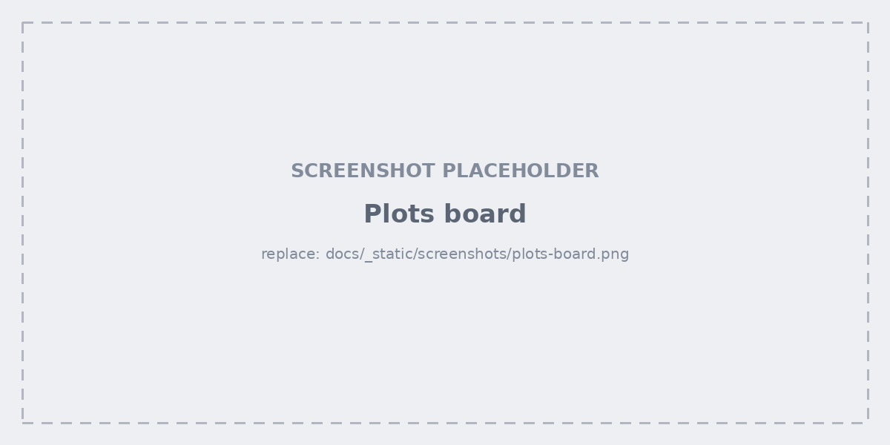

One card per signal, laid out in a resizable board. Per card: reset zoom,
export to CSV or JSON, and a settings menu for curve colour, smoothing, the
standard-deviation band, and markers.

Right click actions details
~~~~~~~~~~~~~~~~~~~~~~~~~~~~

Right-click a plot for: reset zoom, curve colour, **load weights at this
step**, hide/show a curve, break by slices, and copy or save the chart as an
image.

Error-band details
~~~~~~~~~~~~~~~~~~~

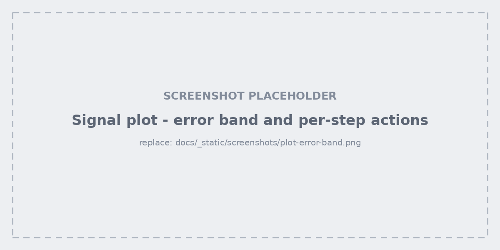

Each point on a curve is the **mean** of that step's batch. The band around it
is not a standard deviation, it is the batch's **actual lowest and highest
sample values**. A step containing one bad outlier makes the band spike out to
it, so the anomaly becomes *more* visible rather than being smoothed away.

From a point on the curve:

- **Highlight step samples**, filters the data grid to the whole batch behind
  that point, so you can look at what produced the spike.
- **Save step snapshot**, freezes that step's per-sample values into their own
  metadata column. Worth knowing: per-sample metadata otherwise only holds the
  *latest* value logged for a sample, so a spike from several epochs ago is
  unrecoverable by the time you notice it. Snapshot it before you move on.

Signals curves merged
~~~~~~~~~~~~~~~~~~~~~~

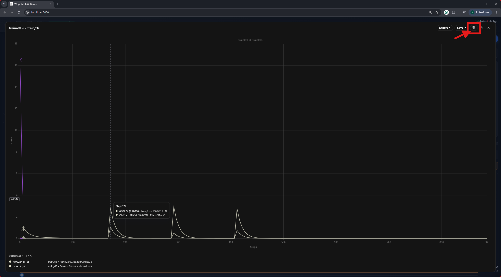

Merge two signals onto one chart to compare them directly; the merged card is
titled ``A <> B``. Merges compose, merging again gives ``A <> B <> C``, with
no nesting and no limit.

Merged plots are a **UI-only** construct: the backend never hears about them,
nothing is persisted server-side, and removing one leaves the source signals
untouched.

Signals curves search
~~~~~~~~~~~~~~~~~~~~~~

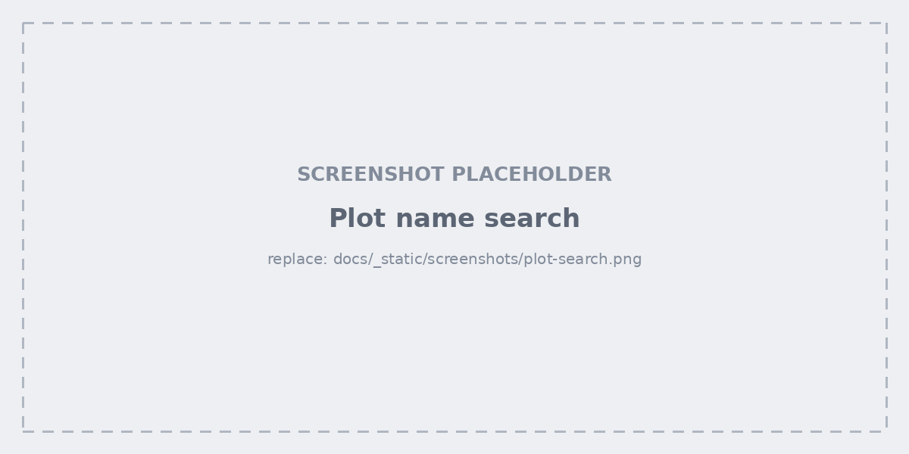

Search lives in the plots board header:

- **While typing**, a centred popup previews the matching plots. The real
  cards are *moved* into it, so the preview is live; closing it puts every card
  back exactly where it was.
- **On Enter**, the popup closes and the board reorders itself with matches
  first. Nothing is hidden.

Two inline toggles control matching: **Aa** for case sensitivity and **Reg**
for regex (on by default, so ``loss|grad`` finds either). With regex off, ``|``
still separates alternatives but each is matched literally.

.. _studio-resource-monitoring:

Resource monitoring signals
~~~~~~~~~~~~~~~~~~~~~~~~~~~~

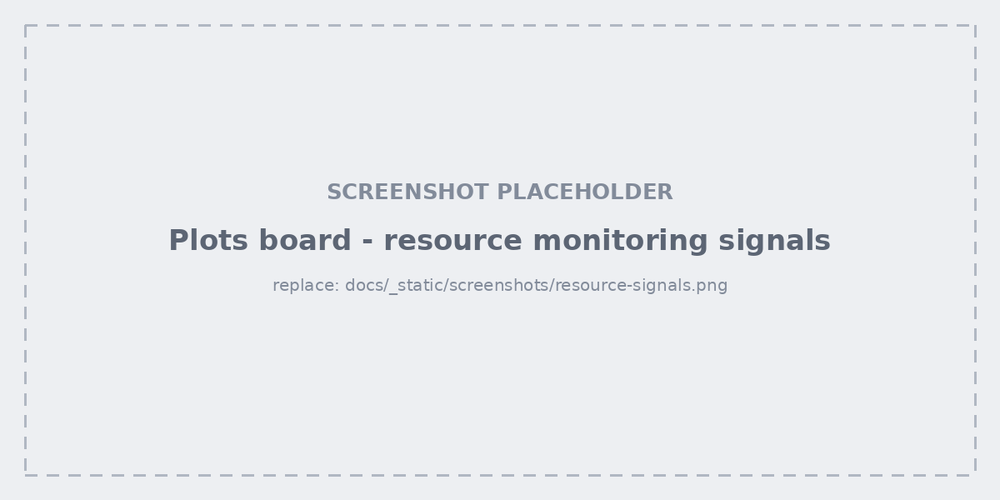

WeightsLab samples CPU, memory, disk, network, GPU and process usage in the
background for the whole life of the backend, and logs every value through the
**same signal pipeline as your losses and metrics**. There is no separate
dashboard: the curves land in the plots board like any other signal, named
with a ``resource/`` prefix. This is on by default and needs no setup.

Type ``resource/`` into the plots board search above to pull every resource
curve to the front of the board. Narrow it from there, ``resource/gpu`` for
the accelerators, ``resource/process`` for the backend process itself, or
``resource/gpu|resource/memory`` to compare both at once (search is regex by
default).

The signals, by category:

.. list-table::
   :header-rows: 1
   :widths: 18 82

   * - Category
     - Signals
   * - ``cpu``
     - ``resource/cpu/utilization_percent``
   * - ``memory``
     - ``resource/memory/system_utilization_percent``
   * - ``disk``
     - ``resource/disk/utilization_percent``, ``…/utilization_gb``,
       ``…/read_mb``, ``…/written_mb``
   * - ``network``
     - ``resource/network/bytes_sent``, ``…/bytes_received``
   * - ``process``
     - ``resource/process/cpu_utilization_percent``, ``…/cpu_threads_in_use``,
       ``…/memory_in_use_mb``, ``…/memory_in_use_percent``,
       ``…/memory_available_mb``
   * - ``gpu``
     - ``resource/gpu/<index>/memory_clock_mhz``, ``…/sm_clock_mhz``,
       ``…/memory_allocated_bytes``, ``…/memory_allocated_percent``,
       ``…/temperature_celsius``, one full set **per device**

Reading them next to your own curves:

- **Merge** a resource curve with a training signal
  (``resource/gpu/0/memory_allocated_percent <> train_loss``) and read them on
  one chart. A batch-size change that moved GPU memory and a loss that moved at
  the same step line up visually.
- Resource curves **restart at 0 when training does**, so they stay comparable
  across restarts instead of carrying on from wherever process uptime had
  reached.
- While training is paused the model's age doesn't move, so samples don't stack
  into a vertical smear at one x, the curve simply waits.

Set ``WL_RESOURCE_MONITOR_STEP_SOURCE=seconds`` to plot against elapsed seconds
since the monitor started instead. Useful when you care about wall-clock
behaviour (a memory leak over hours) rather than per-step behaviour, at the cost
of an axis no other plot shares.

.. note::

   Because the monitor is tied to the backend rather than the training loop, the
   curves keep updating while training is **paused**, and between experiments.
   A GPU that stays pinned after you hit Pause is visible here.

Configuring it: two ways, and the YAML wins where both are set.

**Environment variables**, before starting the backend:

.. code-block:: bash

   export WEIGHTSLAB_DISABLE_RESOURCE_MONITORING=1        # turn it all off
   export WL_RESOURCE_MONITOR_INTERVAL_SECONDS=30         # sample less often
   export WL_RESOURCE_MONITOR_CATEGORIES=cpu,memory,gpu   # allowlist; others off
   export WL_RESOURCE_MONITOR_DISK_PATH=/data             # which filesystem to report
   export WL_RESOURCE_MONITOR_STEP_SOURCE=seconds         # x axis: wall-clock instead

**A** ``resource_monitoring.yaml`` **file**, which is the better fit when you
want to keep everything on and disable one thing:

.. code-block:: yaml

   resource_monitoring:
     enabled: true
     interval_seconds: 15
     disk_path: "/"
     step_source: model_age
     categories:
       disk: false        # everything else stays on
       network: false

The env var takes a comma-separated **allowlist**, anything not named is off —
while the YAML takes **per-category booleans**, so reach for the file when you
only want to switch one category off.

.. list-table::
   :header-rows: 1
   :widths: 38 62

   * - Situation
     - What to change
   * - Shared or metered filesystem
     - Point ``disk_path`` at the volume your data actually lives on; the
       default reports the OS root, which is rarely the interesting one.
   * - Long runs, board feels crowded
     - Raise ``interval_seconds``. At the default of 15s an overnight run logs
       thousands of points per signal.
   * - No NVIDIA GPU
     - Nothing, the ``gpu`` category detects the missing driver and no-ops.
       Every other category is unaffected.
   * - Profiling a memory leak
     - ``step_source: seconds``, so the axis tracks wall-clock uptime rather
       than restarting with training.
   * - Container with restricted ``/proc``
     - Narrow ``WL_RESOURCE_MONITOR_CATEGORIES`` to what the container can
       actually read.

See :doc:`../resource_monitoring` for the full reference, the config lookup order,
every environment variable, and where the monitor thread runs.

.. _studio-data-board:

Data Board
----------

Grid mode for data exploration
~~~~~~~~~~~~~~~~~~~~~~~~~~~~~~~~

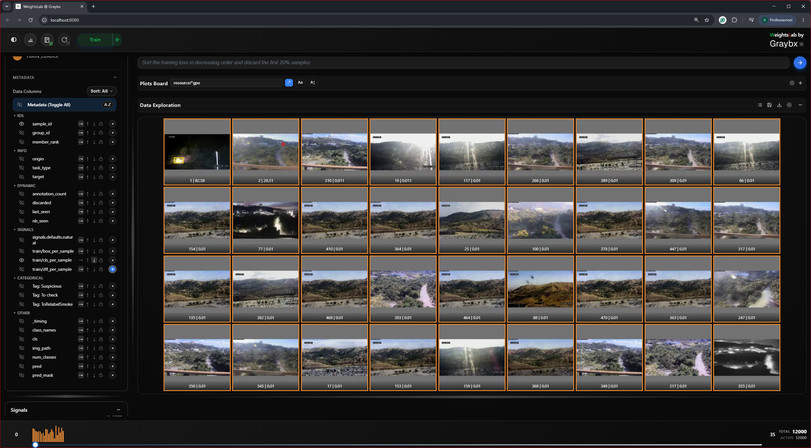

One cell per sample: the image (with whichever overlays are enabled), the
metadata fields you selected, and a per-sample loss trajectory sparkline.
Click a cell to open the :ref:`studio-detail-modal`.

List mode for data exploration
~~~~~~~~~~~~~~~~~~~~~~~~~~~~~~~~

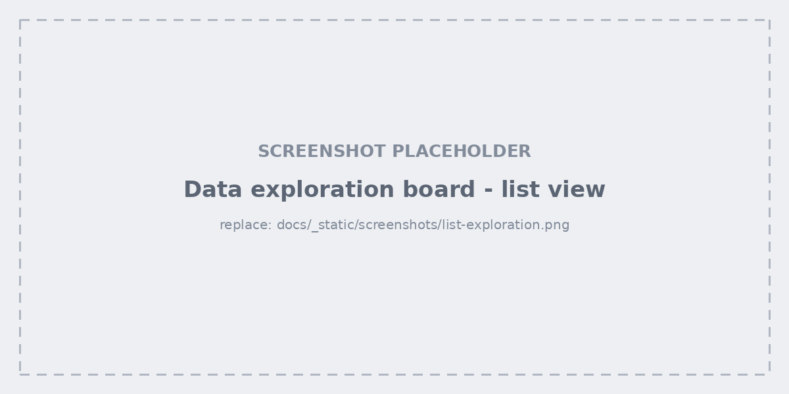

The same data as a table, one row per sample, a leading image column, and one
column per visible metadata field. This is the view for sorting and comparing
numbers rather than looking at pictures:

- **Click a column header** to sort, it cycles descending → ascending → off.
- **Click the lock icon** to pin a column so it survives later sorts.
- **Right-click a header** for clone, delete, reset, and histogram.
- **Click a row** to open that sample's detail modal.

Sort state is shared with the grid, so switching views never reshuffles what
you were looking at.

Quick filters
~~~~~~~~~~~~~~

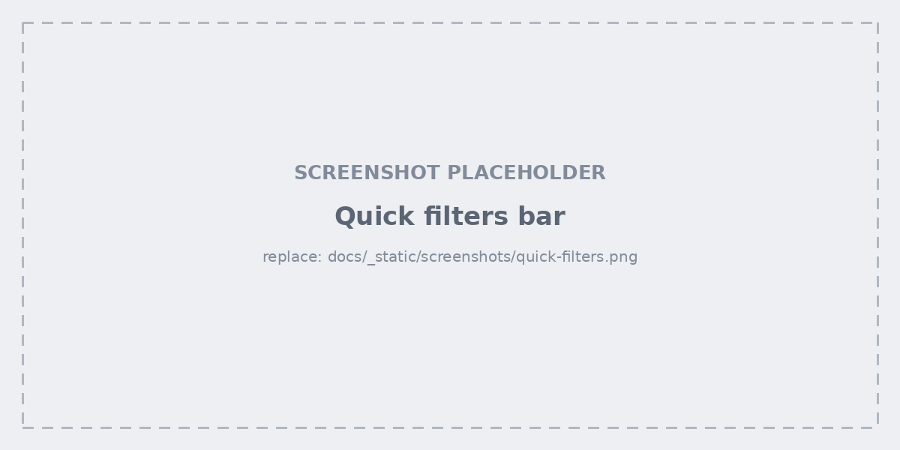

Filter and sort **without going through the agent**, no LLM in the loop, no
waiting. Build conditions from a column, an operator
(``==``, ``!=``, ``>``, ``<``, ``>=``, ``<=``, ``between``, ``contains``,
``has_tag``, ``not_has_tag``) and a value, stack several, and add a sort.

Use quick filters for the mechanical slices you already know you want
("loss > 2.0", "has_tag hard_examples") and the agent for the ones you'd
struggle to express as a predicate.

Subviews and reset
~~~~~~~~~~~~~~~~~~~~

When a filter or an agent query narrows the grid, a banner reports how many
samples matched and the query behind them. **Reset** on that banner (or typing
``@reset`` in the agent bar) puts the grid back to the full dataset.

Selection and the context menu
~~~~~~~~~~~~~~~~~~~~~~~~~~~~~~~~

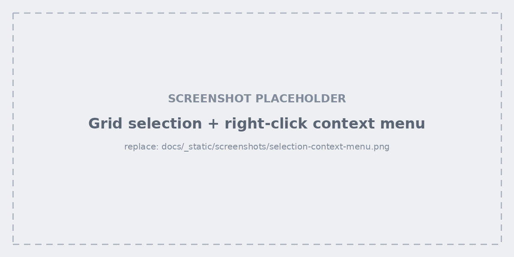

- **Drag** a rectangle across cells to select a range.
- **Ctrl+click** to add or remove individual cells.
- **Right-click** the selection for the context menu: manage tags, discard
  samples, restore discarded ones.

Discarding removes samples from the model's active set without deleting
anything, the counter in the bottom bar shows *total* against *active*, and
a discard is always reversible.

Tagging modal
~~~~~~~~~~~~~~

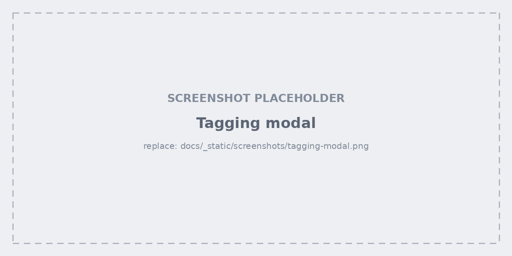

The full tag editor for a selection: existing tags, tags already on the
selection, quick-tag chips, and clear/cancel/apply. Use this when applying
several tags at once; use painter mode (:ref:`studio-left-panel`) when
applying one tag to many samples.

Bottom bar
~~~~~~~~~~~

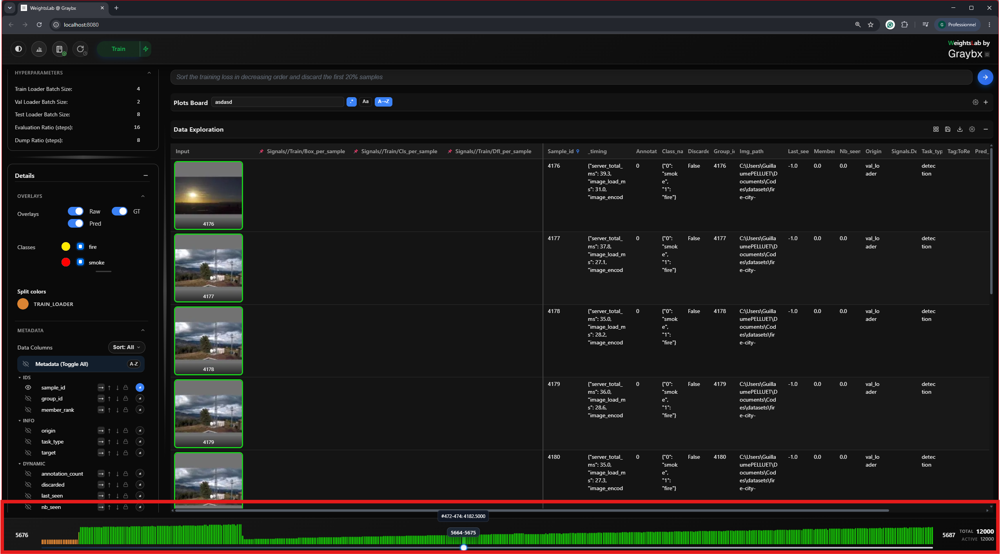

The batch slider walks through the dataset a page at a time, with the start and
end sample indices either side of it. On the right: **total available samples**
and **active samples used by the model**, the gap between them is exactly what
you have discarded.

.. _studio-detail-modal:

Detail modal
~~~~~~~~~~~~~

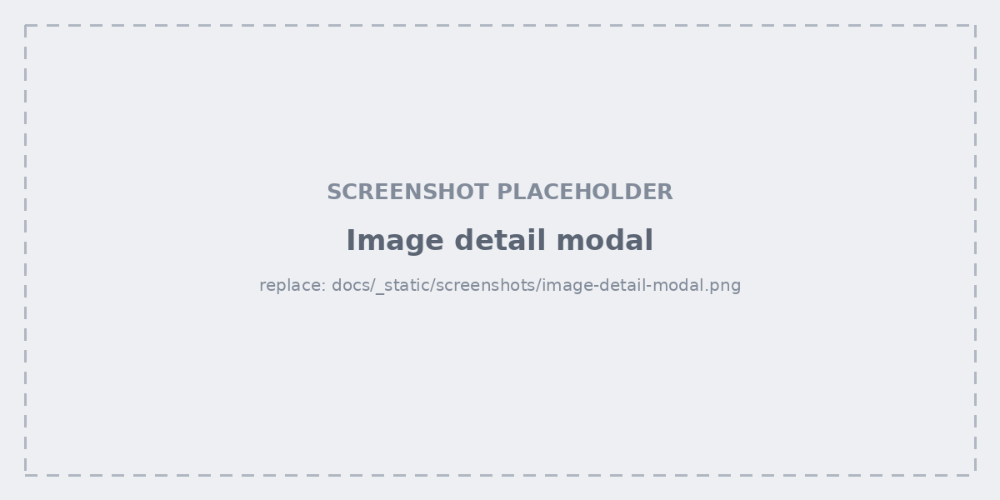

Opened by clicking a grid cell or a list row.

- **Navigate** with the previous/next buttons or the ``←`` / ``→`` keys —
  you can walk a whole filtered subview without going back to the grid.
- **Zoom** in, out, reset, or fit to the pane.
- The **metadata panel** beside the image lists every field for the sample,
  and the pane divider can be dragged to give either side more room.

Overlays
^^^^^^^^^

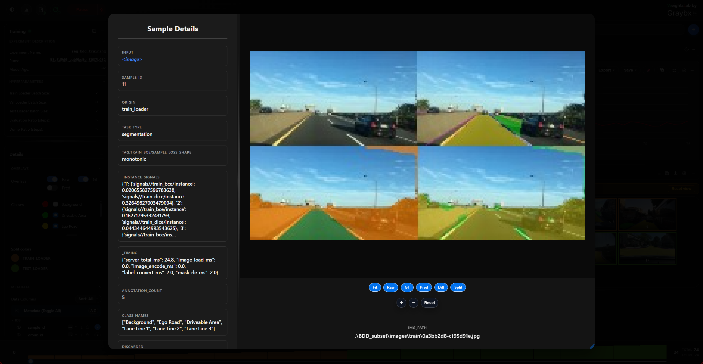

Independent toggles for **raw**, **ground truth**, **prediction**, plus two
comparison modes:

- **diff**, ground truth against prediction in one image.
- **split**, the two side by side.

For detection runs, a bounding-box info control reports what is drawn; the
number of boxes rendered is capped by ``BB_MODAL_RENDER`` (and
``BB_THUMB_RENDER`` for thumbnails).

Point clouds, video and text
^^^^^^^^^^^^^^^^^^^^^^^^^^^^^^

The modal adapts to the sample's modality.

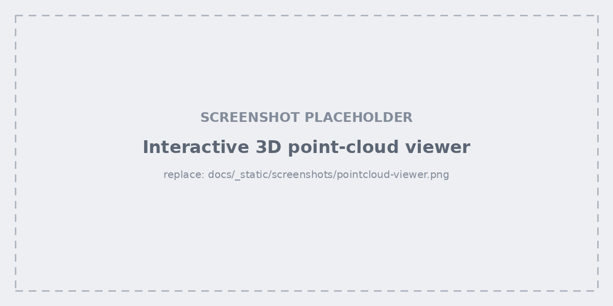

**Point clouds** open in an interactive 3D viewer, orbit, zoom, and expand it
to fill the screen. Cap the rendered points with ``PC_MAX_POINTS`` on very
dense scans.

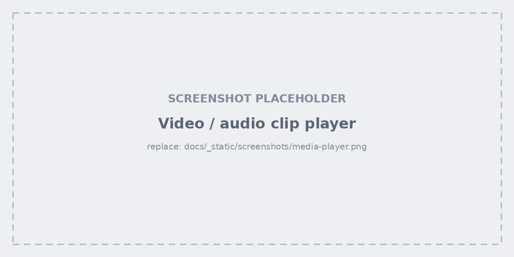

**Video and audio clips** get a player with frame-by-frame stepping and a
frame slider, so you can land on the exact frame a signal spiked on.

**Volumetric images** get a Z-slice slider, and **text samples** render as
text rather than as an image.

.. _studio-projection-board:

Projection Board
----------------

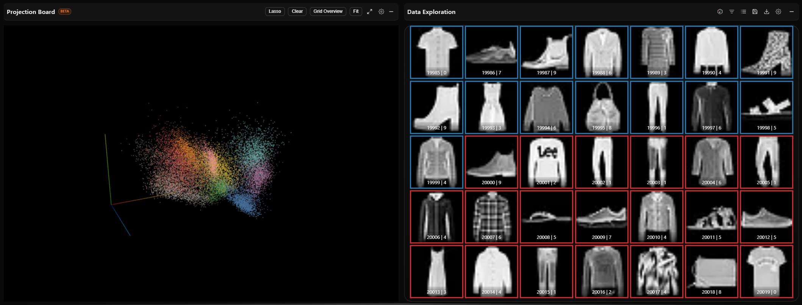

.. note::

   **Beta** — the board carries a *Beta* pill in its header. It works end to
   end, but its controls may still change between releases.

A navigable 3-D view of the representation the model is learning: one point per
sample, placed by the live parametric-UMAP encoder (see :doc:`../projection`
for the training-side half), or by a projection you computed yourself.

The board is opened from the **Projection** button in the Data Exploration
header, and opens beside the Data board. Nothing about a run puts it on screen
by itself. Opened before there is anything to draw — before the first fit, with
the projection turned off, or before you plugged in your own — it shows an
orange **No projection found** ribbon with the backend's reason, and fills in
as soon as coordinates arrive — no reload needed.

Navigating
~~~~~~~~~~

- **Drag** to orbit the cloud.
- **ctrl+scroll** to zoom toward the cursor — the same gesture the plots use.
  Plain scroll is left to the page, so the board never traps your wheel.
- **Fit** re-frames the whole cloud.
- The **expand** button gives the projection the whole view (Esc to exit).
- Keyboard: ``L`` lasso · ``R`` reset · ``C`` clear · ``F`` fit · ``E`` expand.

Which projection
~~~~~~~~~~~~~~~~

A run can hold several projections: the live ``umap`` one, offline
re-projections from other layers, and any you computed yourself with t-SNE,
``umap-learn`` or anything else (``wl.save_projection_coords`` /
``wl.project_dataset(method=...)``, see :ref:`projection-bring-your-own`). When
there is more than one, a picker in the header switches between them; with the
built-in turned off, the board opens directly on yours.

The status line counts points, e.g.
``4,812 pts (of 61,004 in view) · 70,000 projected · 120 fits``. The fit count
belongs to the live encoder, so it is shown only for its projection.

The axes are unlabelled on purpose: UMAP coordinates carry no units, so they
are an orientation cue only.

Selecting samples
~~~~~~~~~~~~~~~~~

Double-click a point, or switch on **Lasso** and drag a loop around a region.
Either way the result lands in the :ref:`studio-data-board` as an ordinary
filter, so the grid, the list view and every existing affordance work on it. A
single click only names the point (``sample 1234``).

The lasso selects **every sample inside the loop, drawn or not**. The cloud on
screen is a level-of-detail subsample (see below), so the selection is made on
the server over the whole projection and applied to the Data board from there;
the status line shows its size. While the lasso is armed, a line over the cloud
says what the next loop will do:

- **Shift** adds what is inside the loop to the current selection.
- **Ctrl** *refines* it: only the samples already selected that are also inside
  the new loop are kept. A single loop selects a whole column through the
  cloud; rotate the cloud and Ctrl-lasso the same cluster again, and the two
  columns intersect in a 3-D volume — the cluster alone. The loop is drawn
  dashed cyan while Ctrl is held.

With **Overview** following a grid page, every point of the page is drawn, so
the lasso simply selects the drawn points.

The projection itself is **never** filtered by that selection — it draws the
whole dataset, with the selection highlighted. Following its own filter would
collapse the cloud to the points just selected, leaving nothing to select from
next. **Clear** drops the selection and the highlight.

**Overview** decides whether the cloud follows the Data board's *other*
filters (a query you or the agent applied). Off by default: the cloud shows the
whole dataset, which is what lets you see where a filtered subset sits in the
representation. Switch it on to draw only the Data board's current view.

The other way round, right-click a sample in the grid and choose **Highlight in
Projection** to find it in the cloud. Right-clicking inside the cloud itself is
the same as **Reset view**.

Colour
~~~~~~

The settings cog holds the colour picker, the point size and **Reset view**
(camera, axes, selection and highlight).

Points are coloured by **Class** (the ground-truth label) by default — on a
classification set, the classes are what the clusters mean. **Split** uses the
grid's split palette, so a sample is the same colour everywhere in Studio. Any
metadata column works too: numeric columns get a ramp, categorical ones a
palette. Discarded samples are drawn grey, still in place.

Level of detail
~~~~~~~~~~~~~~~

The board never downloads the whole dataset. It asks for the points its camera
can see — the view frustum — up to a render budget (70,000 by default), and
the server answers with that many of them; zooming in narrows the frustum, so
the same budget buys finer detail. Every camera move that settles asks again.
The subtitle says how many are drawn; hovering it says of how many in view.

The budget is set where the projection is served, for every viewer at once:
``WEIGHTSLAB_PROJECTION_MAX_POINTS`` in the training process's environment, at
most 400,000.

.. code-block:: bash

   WEIGHTSLAB_PROJECTION_MAX_POINTS=150000 python train.py

It is read on every request, so in a run that is already going, setting it from
the Studio notebook applies at the next camera move:

.. code-block:: python

   import os
   os.environ["WEIGHTSLAB_PROJECTION_MAX_POINTS"] = "150000"

One browser can override it for itself, in its developer console (remove the
key to go back to the server's value):

.. code-block:: javascript

   localStorage.setItem('projection-render-budget-v1', '200000')

Two properties follow from the sampling being deterministic rather than random:
repeated requests pick the same points (the cloud does not boil when you nudge
the camera), and zooming in only *adds* points. The sample is also
**stratified** by cluster, at a density proportional to ``1/sqrt(cluster
size)``: a cluster 100 times smaller is drawn 10 times denser than a flat
sample would draw it, so a small cluster cannot be sampled out of existence and
read as noise, and every class still appears when the dataset is many times the
budget.

The server keeps an index of the projection — the sampling order and a spatial
grid — rebuilt in the background as training moves the points, so a view costs
about what it returns rather than the size of the dataset: about 0.1 s for
50,000 points whether the projection holds one million samples or ten. The
first open of a large projection builds that index once (a few seconds at 10M
samples).

With **Overview** following a grid page, the cloud is exactly that page, drawn
whole: no budget and no frustum.

The status line says plainly when the view is decimated (the ``of ... in
view`` part), so a level-of-detail subsample never reads as all the data there
is.

Arranging the boards
--------------------

Every board in the main area — Plots, Data, Projection, and any added later —
is dragged by its header title:

- drop on the **top or bottom half** of another board to stack above or below it;
- drop on a **left or right edge** to sit alongside it, splitting the width.

The board you are dragging over highlights the exact edge you will land
against, and the arrangement is remembered between sessions.
